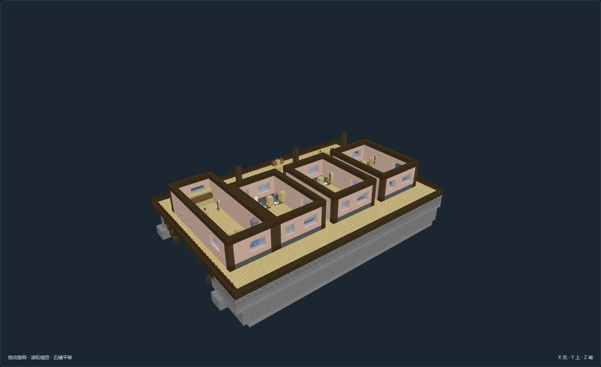

# CN-04-v02 · 长廊望谷栈 · 悬崖旅舍

已完成离线数据、通路和图像验收；34 张视图见当前验收记录。

- 选址：高原岩台边缘，北侧接稳定地面，南侧朝开阔谷地
- 高程：主平台地板 Y=7，入口脚底 Y=8；外接同高岩台道路
- 固定与承重：北侧石砌锚座压在实体岩台，南侧木梁和斜撑回接石墩；石墩底必须落在连续承载岩层。不可当作无支撑浮空结构。
- 接驳边界：模板内支撑与边栏完整；外侧山体、接驳道路、峡谷宽度及航行净空必须按实际场地核对。
- 运行边界：泊位、缆索、风向仪、船体与吊装均为静态空间表达；未实现飞行、气象、物流或受力模拟。

[作者标记](author.json) · [数据与通路](validation.json) · [验收记录](review.json)

在 `tools/structure_studio` 运行 `python -m studio.build CN-04-v02` 可重建。

尚未接入国度 Mod 运行时；设备和家具为静态空间表达。
