# 空艇幻想 · 验收画廊

[返回入口](README.md) · [核心清单](建筑清单.md) · [填充清单](建筑清单.md)

全套49项完成作者离线验收，7座核心/专项133图、42项填充886图，共1019张当前双哈希归档截图。作者冻结供主审交叉审查；本次新增商铺157图已实际逐张查看。这里挑选外观与剖面作快速浏览；完整截图和双哈希结论在各模型目录。

## CN-01-v01 · 峡谷冠台 · 飞空艇泊塔

候船和站务分置两翼，直上步梯连接12格高差；高架泊台的下层作为地面理货廊。 系留桅杆是静态设施，承台由四排柱梁传力到石墩；登船端仅短挑出六格。

[完整作者记录](models/CN-01-v01/author.json) · [验收](models/CN-01-v01/review.json)

## CN-02-v01 · 双脊风帆库 · 船体修造库

开放端的长跨双脊屋盖与西侧两间低檐工作生活房形成体量层次。 船体为开放龙骨修造阶段；高原地面工厂，不假定整栋悬空或船坯可驾驶。

[完整作者记录](models/CN-02-v01/author.json) · [验收](models/CN-02-v01/review.json)

## CN-03-v01 · 折阶观风塔 · 风向导航塔

实体石塔与外置十二级步梯构成明确的观測高差；低层值守房沿北侧岩台布置。 风向旗与避雷外形是静态参考；只能在实际视线开阔、天气观测有需求的地方选用。

[完整作者记录](models/CN-03-v01/author.json) · [验收](models/CN-03-v01/review.json)

## CN-09-v01 · 三庭观云馆 · 气象学馆

教学与实验分列两翼，后部档案形成三面围庭；中庭仪器与高旗杆成为公共辨识点。 庭院不是已实现气象采样系统；选址应避开实际风雨遮蔽，书馆样本和观测机制另接。

[完整作者记录](models/CN-09-v01/author.json) · [验收](models/CN-09-v01/review.json)

## CN-10-v01 · 双翼航图厅 · 航路议事所

高脊中厅、狭长档案与会客双翼、后庭凉廊构成公共院落。 桌面航图为静态陈设；本体不承诺航线管理或议事机制。

[完整作者记录](models/CN-10-v01/author.json) · [验收](models/CN-10-v01/review.json)

## CN-11-v01 · 断缆旧站 · 废弃泊塔

废弃状态来自断链、拆除的登船端、后部破板和封边，不牺牲仍可探索的旧站务室。 只在航路改变的历史节点明确选用；破损区不可作为运行中的泊位。

[完整作者记录](models/CN-11-v01/author.json) · [验收](models/CN-11-v01/review.json)

## CN-12-v01 · 岩坳折翼营 · 坠落船骸回收营

住宿、分拣棚与偏折船骸形成三块独立作业空间；外缘木台由实体岩坳承接。 船骸是预制静态情景，不能宣称模拟过坠落；实地地形和历史来源必须匹配。

[完整作者记录](models/CN-12-v01/author.json) · [验收](models/CN-12-v01/review.json)

## 填充结构 · 42个独立变体

居住补齐厨房、共餐、坐读、个人储藏和隐私；商铺按八种行业分别组织销售、加工、存储与生活。每项入口、地形与功能点详见[填充清单](建筑清单.md)。以下每型各取一张最终剖面，完整视图在验收记录中。

### CN-04-v01 · 四门围庭栈 · 悬崖旅舍

四间双床客房围绕中央接待庭，后部独立厨房餐厅；房门朝向内庭，外缘作为观景绕行廊。

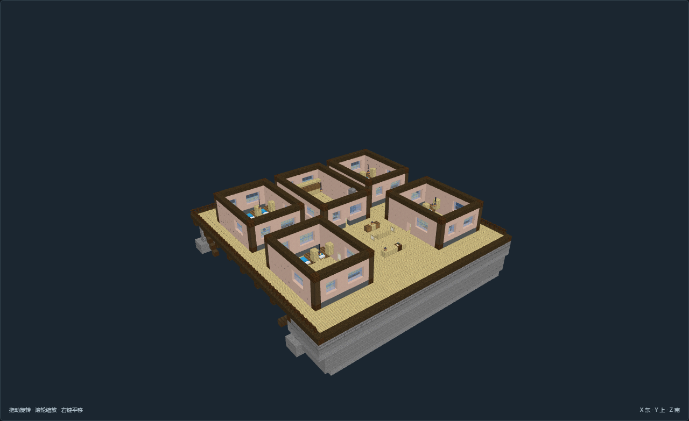

[作者标记](models/CN-04-v01/author.json) · [完整验收 40图](models/CN-04-v01/review.json)

### CN-04-v02 · 长廊望谷栈 · 悬崖旅舍

狭长岩沿布置三间双床客房，连续南向观景长廊承担入房、接待与休息，东端为小餐厅。

[作者标记](models/CN-04-v02/author.json) · [完整验收 34图](models/CN-04-v02/review.json)

### CN-04-v03 · 分台双院栈 · 悬崖旅舍

低台餐厅和四床通铺，高台两间双床安静客房；四级台阶与独立带栏廊道回应自然双岩台。

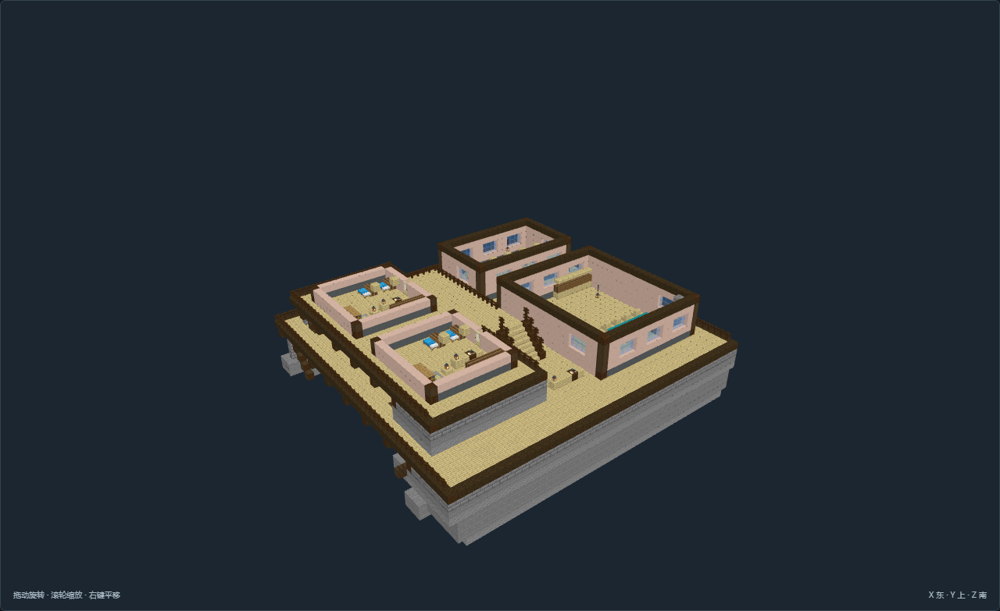

[作者标记](models/CN-04-v03/author.json) · [完整验收 36图](models/CN-04-v03/review.json)

### CN-04-v04 · 叠阁悬崖栈 · 悬崖旅舍

下层餐厅与有顶接待廊、上层两间四床客房，独立外阶接宽观景走廊，适合较窄但可建两层的悬崖台地。

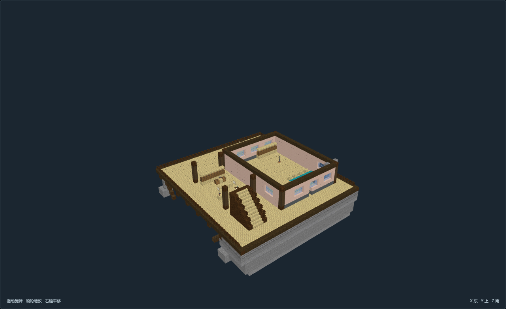

[作者标记](models/CN-04-v04/author.json) · [完整验收 35图](models/CN-04-v04/review.json)

### CN-05-v01 · 短挑双床宅 · 悬臂住宅

单户南向短挑阳台；前段厨房起居、后段独立双床卧室，入口落在北侧实体锚座。

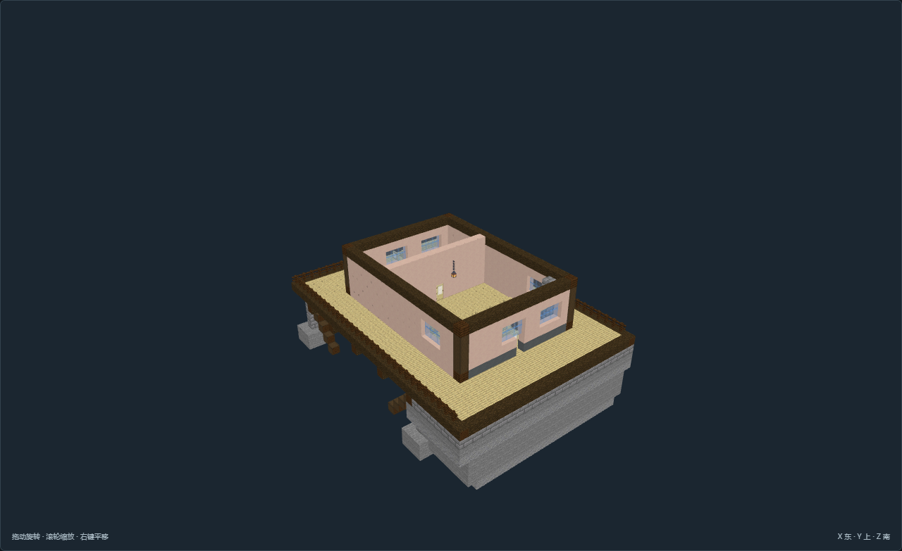

[作者标记](models/CN-05-v01/author.json) · [完整验收 19图](models/CN-05-v01/review.json)

### CN-05-v02 · 并门双户宅 · 悬臂住宅

两套各有厨房的独立家庭住宅，以中间巷道和后部公共阳台连接；不共享卧室。

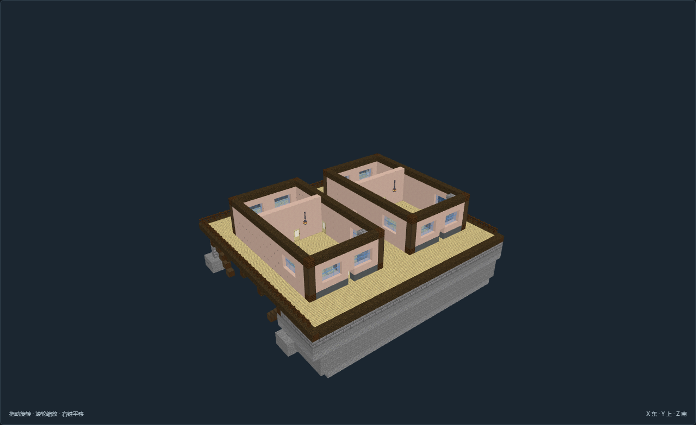

[作者标记](models/CN-05-v02/author.json) · [完整验收 27图](models/CN-05-v02/review.json)

### CN-05-v03 · 折廊工居宅 · 悬臂住宅

L形工居宅：西侧居住长翼、东北独立修补工房与半围合观景内庭。

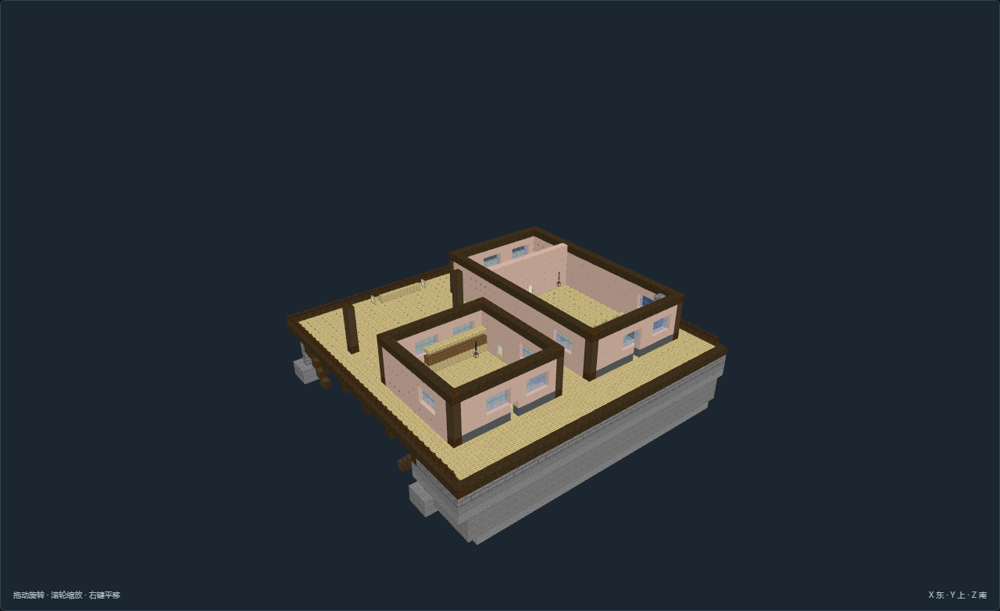

[作者标记](models/CN-05-v03/author.json) · [完整验收 22图](models/CN-05-v03/review.json)

### CN-05-v04 · 叠层望谷宅 · 悬臂住宅

两层紧凑住宅以外置七级楼梯到达四床睡眠层；地面厨房和共餐空间完整，后部留观景短廊。

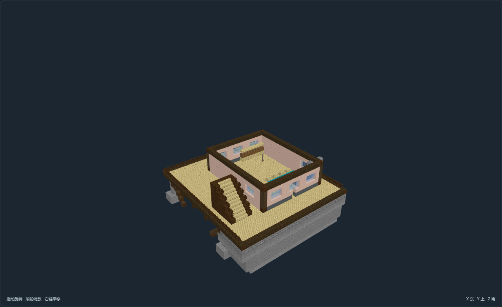

[作者标记](models/CN-05-v04/author.json) · [完整验收 25图](models/CN-05-v04/review.json)

### CN-05-v05 · 分台连桥宅 · 悬臂住宅

低台家庭生活与高四格的客卧分处两个实体固定端，短桥和外阶连接；高台独立石墩直落承载岩层。

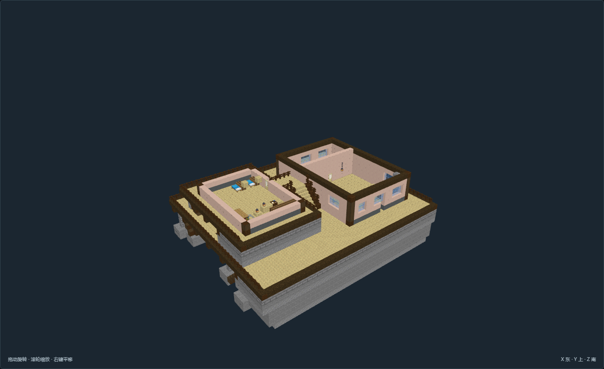

[作者标记](models/CN-05-v05/author.json) · [完整验收 25图](models/CN-05-v05/review.json)

### CN-05-v06 · 长脊峡口宅 · 悬臂住宅

狭长峡口地块上的四床长屋，北锚座与南石台共同承托中段木梁；前段起居面积较大，南端集中卧室与观景。

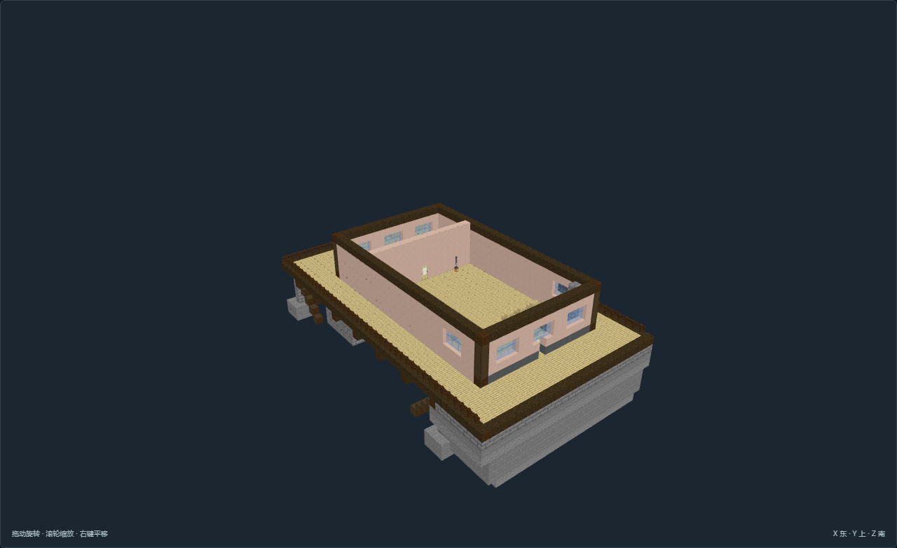

[作者标记](models/CN-05-v06/author.json) · [完整验收 21图](models/CN-05-v06/review.json)

### CN-06-v01 · 六床短廊舍 · 船员宿舍

六床集中在短寝室，后部独立窄餐厅服务同一班组，中间横向过道分开安静与共餐。

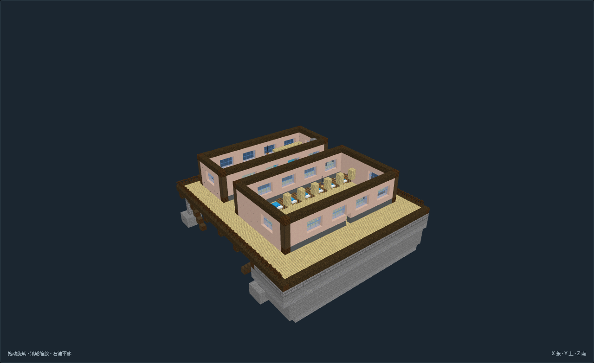

[作者标记](models/CN-06-v01/author.json) · [完整验收 22图](models/CN-06-v01/review.json)

### CN-06-v02 · 长排双寝舍 · 船员宿舍

八床分成东西两间长寝室，中间是贯通带顶步廊；厨房与共餐位于后廊，避开睡眠区。

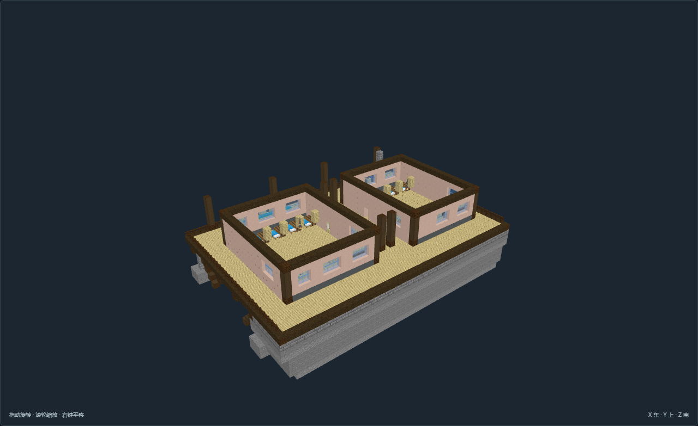

[作者标记](models/CN-06-v02/author.json) · [完整验收 27图](models/CN-06-v02/review.json)

### CN-06-v03 · 三翼共餐院 · 船员宿舍

三翼院落宿舍：双三床寝翼围合中庭，南侧公共食堂，中央存放旅具。

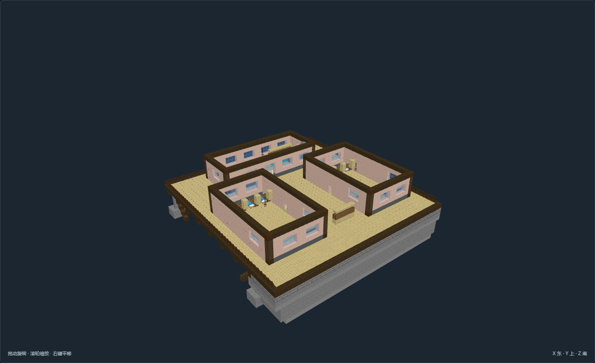

[作者标记](models/CN-06-v03/author.json) · [完整验收 28图](models/CN-06-v03/review.json)

### CN-06-v04 · 上下轮班舍 · 船员宿舍

轮值人员采用上下分层：楼下公共厨房和大型餐桌，楼上四床集中安静层，外阶独立进出。

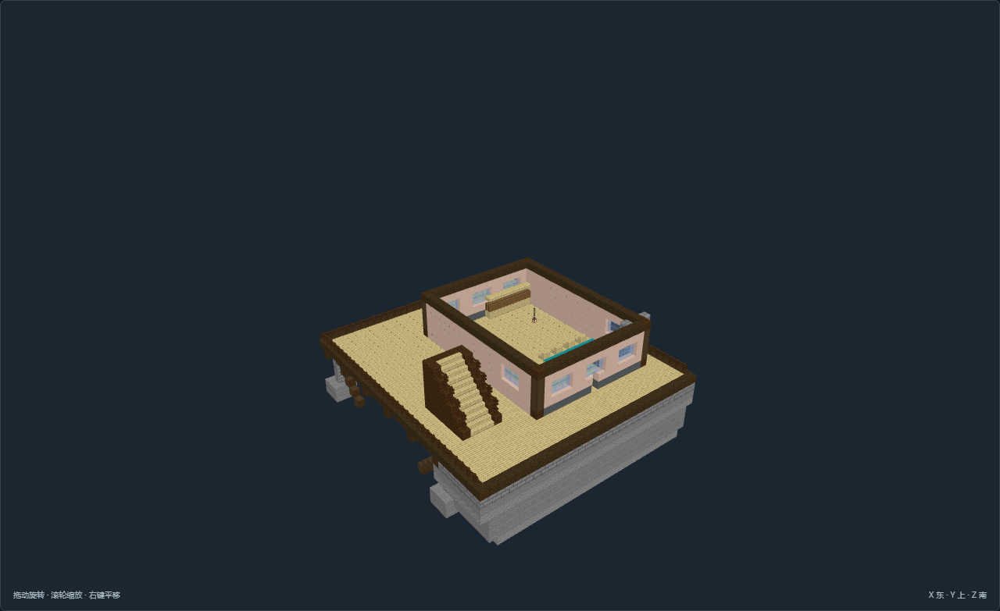

[作者标记](models/CN-06-v04/author.json) · [完整验收 22图](models/CN-06-v04/review.json)

### CN-06-v05 · 分台安静舍 · 船员宿舍

餐厅落在低台，三床安静寝翼高四格独立落墩，带栏短桥分离生活噪声与休息。

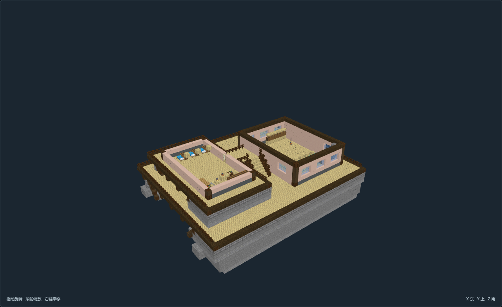

[作者标记](models/CN-06-v05/author.json) · [完整验收 22图](models/CN-06-v05/review.json)

### CN-06-v06 · 对廊器材舍 · 船员宿舍

对廊宿舍为两间三床长翼，中央露天集合廊容纳两组旅具柜；后端独立食堂。

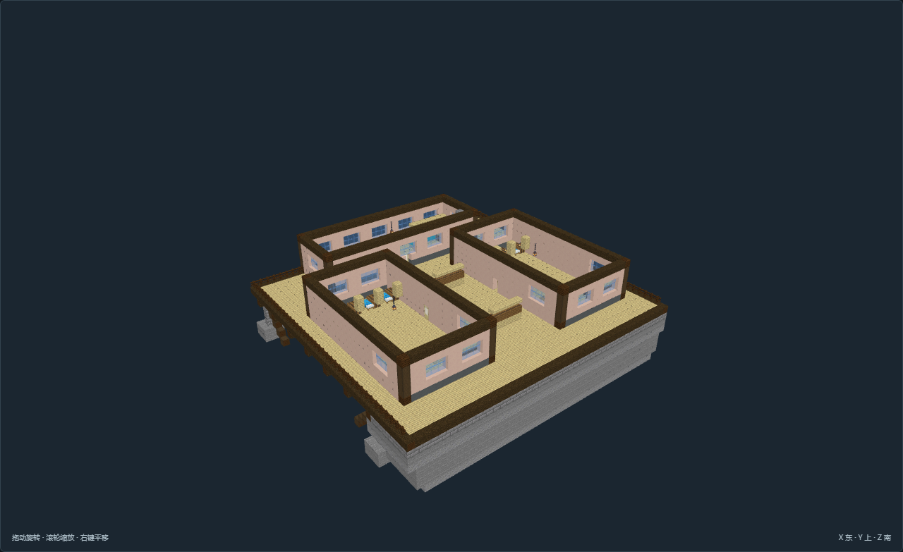

[作者标记](models/CN-06-v06/author.json) · [完整验收 29图](models/CN-06-v06/review.json)

### CN-07-v01 · 短脊麦苗室 · 高原温室

短宽温室采用双侧麦苗床与三格中央通道，后部在支撑台上整理种苗。

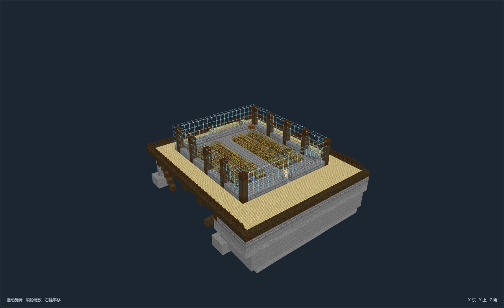

[作者标记](models/CN-07-v01/author.json) · [完整验收 16图](models/CN-07-v01/review.json)

### CN-07-v02 · 长条根蔬室 · 高原温室

窄长地块上的长脊胡萝卜温室，双长床和连续中轴通路；后端独立分拣面。

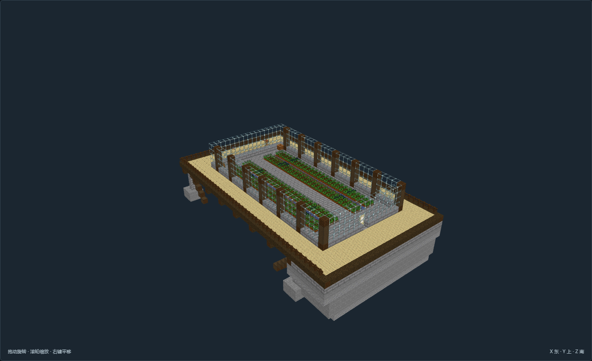

[作者标记](models/CN-07-v02/author.json) · [完整验收 16图](models/CN-07-v02/review.json)

### CN-07-v03 · 折庭育种院 · 高原温室

折形双种植翼围绕小型管理庭，马铃薯与甜菜分开，东北管理房储种。

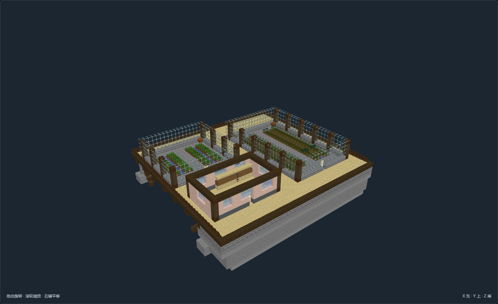

[作者标记](models/CN-07-v03/author.json) · [完整验收 23图](models/CN-07-v03/review.json)

### CN-07-v04 · 分台双温室 · 高原温室

两个真实岩台高差四格，根蔬低室和麦苗高室用外阶及短廊相连，每座温室独立落墩。

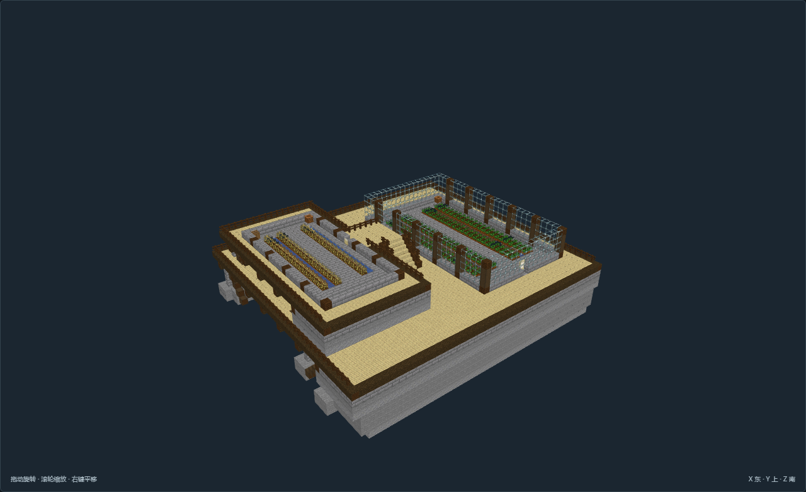

[作者标记](models/CN-07-v04/author.json) · [完整验收 22图](models/CN-07-v04/review.json)

### CN-08-v01 · 纵巷窄仓 · 空港货仓

窄长岩沿单仓保持中央五格理货通道，货架分成四段，前后门对应接货与发货。

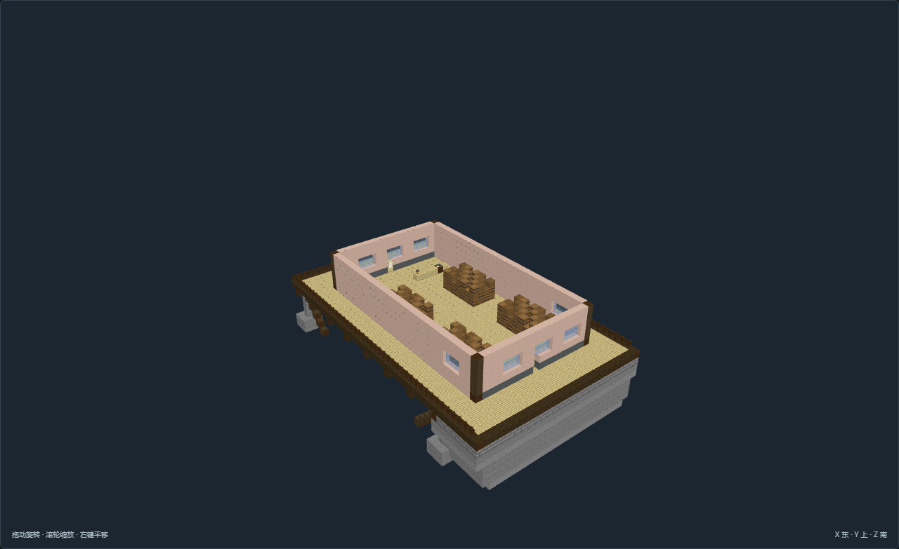

[作者标记](models/CN-08-v01/author.json) · [完整验收 15图](models/CN-08-v01/review.json)

### CN-08-v02 · 叠层备件仓 · 空港货仓

重货落在地面层、轻备件在上层，外置七级阶梯和带柱梁的接驳廊连到二层；不假定自动升降物流。

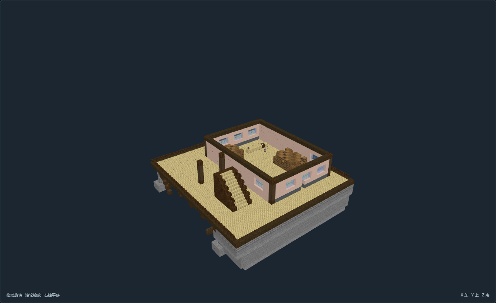

[作者标记](models/CN-08-v02/author.json) · [完整验收 18图](models/CN-08-v02/review.json)

### CN-08-v03 · 双面转运院 · 空港货仓

东西双仓以带顶转运中廊相对，一边接收清点、一边封箱发货，四道侧门缩短搬运路线。

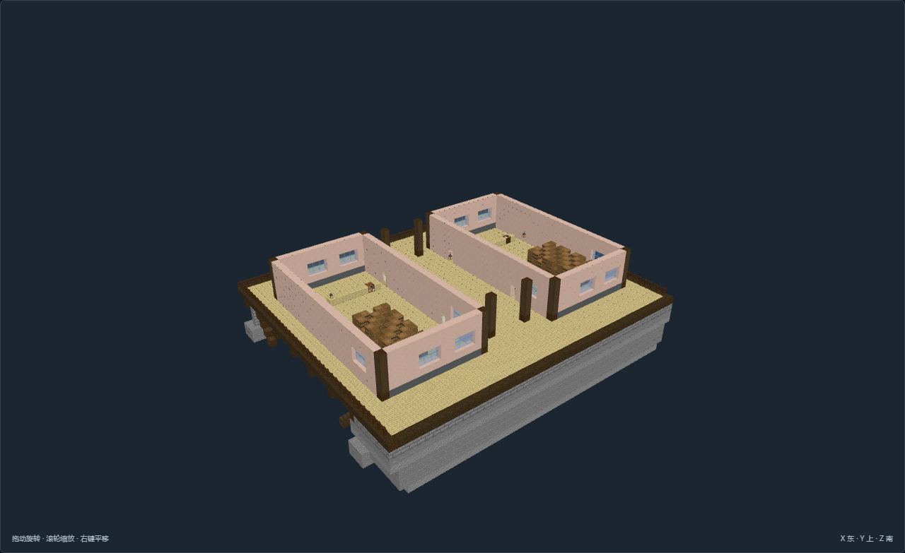

[作者标记](models/CN-08-v03/author.json) · [完整验收 16图](models/CN-08-v03/review.json)

### CN-08-v04 · 分台装卸仓 · 空港货仓

低台大宗补给与高四格小件发运仓独立落墩，中间带栏短廊连接，适用于相邻双台地。

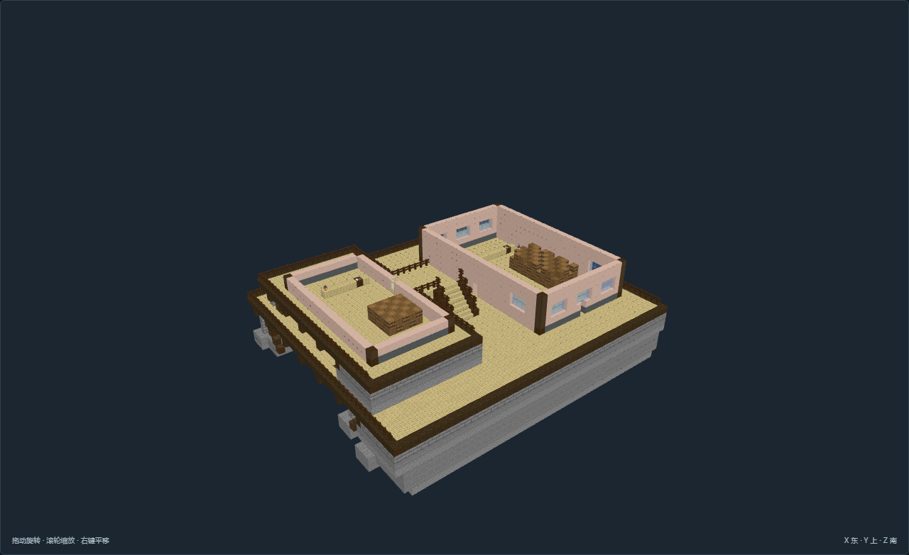

[作者标记](models/CN-08-v04/author.json) · [完整验收 16图](models/CN-08-v04/review.json)

### CN-F01-v01 · 窄巷烘焙铺 · 空港日常小商铺

狭长烘焙铺依次分成售卖、备料、炉灶三段，厨房另有后侧出入口。

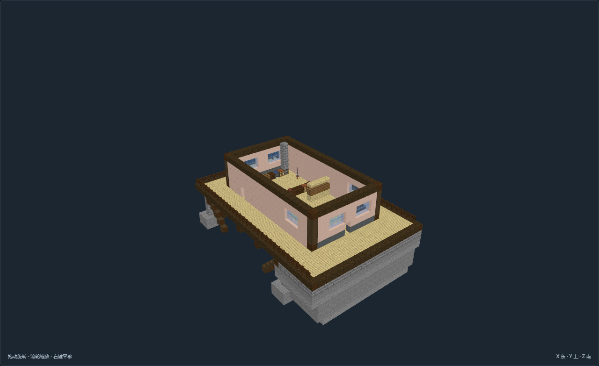

[作者标记](models/CN-F01-v01/author.json) · [完整验收 17图](models/CN-F01-v01/review.json)

### CN-F01-v02 · 折庭帆衣铺 · 空港日常小商铺

L形帆衣铺将接单裁台与织补短翼分开，内庭设带顶等候位，适合平台转角。

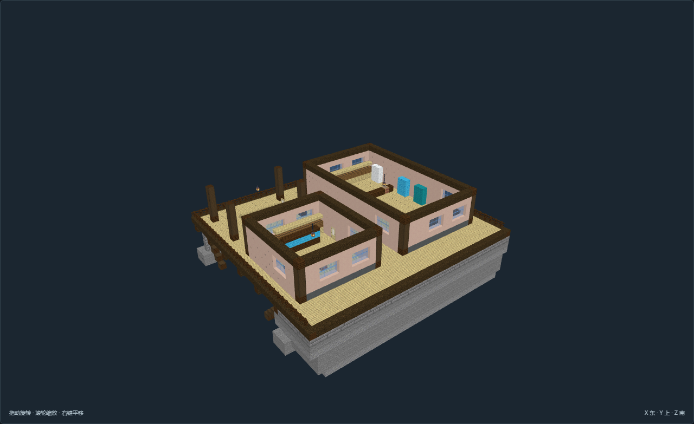

[作者标记](models/CN-F01-v02/author.json) · [完整验收 18图](models/CN-F01-v02/review.json)

### CN-F01-v03 · 双面修具铺 · 空港日常小商铺

宽厅双侧入口保持中部横向通路，北侧工具销售和南侧铁砧磨轮石切台相对。

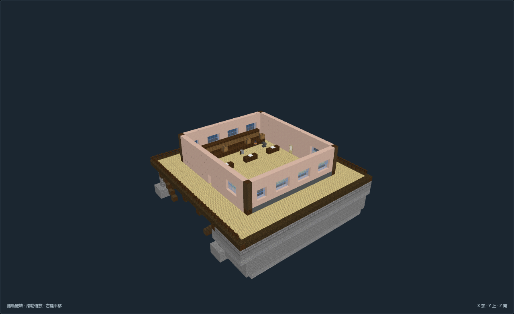

[作者标记](models/CN-F01-v03/author.json) · [完整验收 20图](models/CN-F01-v03/review.json)

### CN-F01-v04 · 航图商住院 · 空港日常小商铺

西侧航图店与东侧店主生活房围成安静小院，业务与睡眠分门，后部共用短廊。

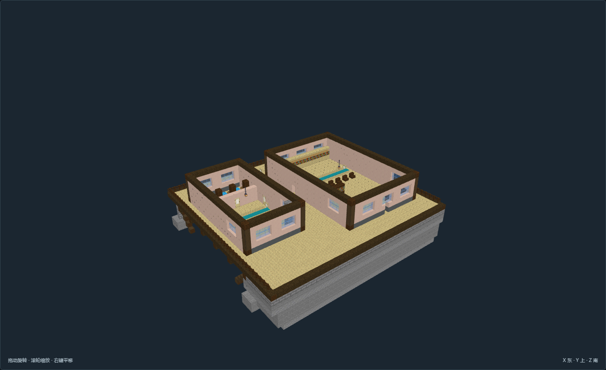

[作者标记](models/CN-F01-v04/author.json) · [完整验收 21图](models/CN-F01-v04/review.json)

### CN-F01-v05 · 双柜食杂铺 · 空港日常小商铺

双柜食品杂货铺保留中央进深通路，后场分装与收货，适合较大的日常补给点。

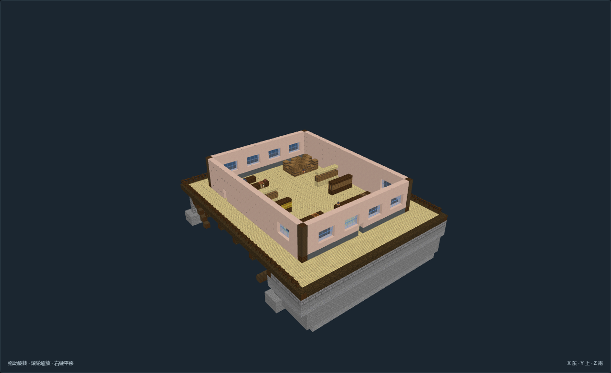

[作者标记](models/CN-F01-v05/author.json) · [完整验收 20图](models/CN-F01-v05/review.json)

### CN-F01-v06 · 长场缆索铺 · 空港日常小商铺

小型接单生活房与长形有顶拉索场并列，链条只代指静态展样，侧边留完整检验通道。

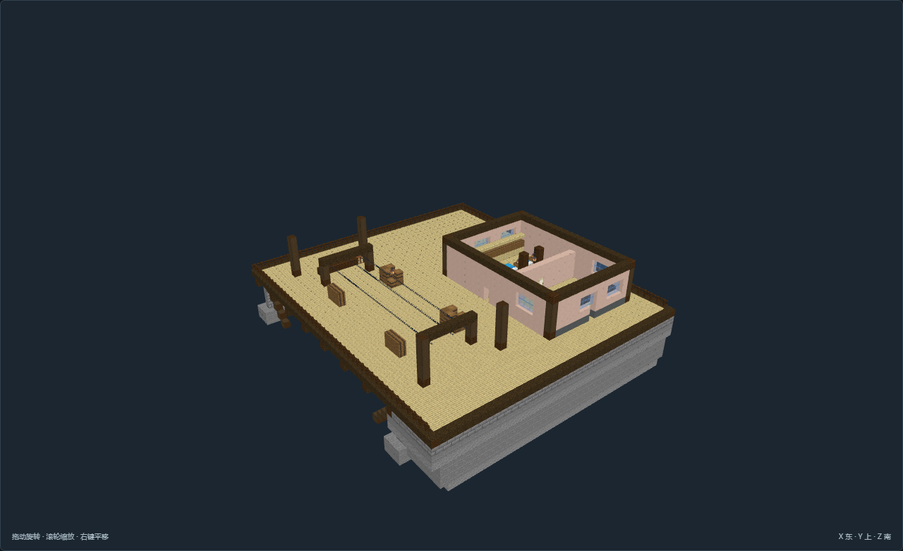

[作者标记](models/CN-F01-v06/author.json) · [完整验收 23图](models/CN-F01-v06/review.json)

### CN-F01-v07 · 高台茶食铺 · 空港日常小商铺

低台封闭茶食房与高四格的观谷茶棚分工，步梯和带栏短廊连接，两个台地各有实体落墩。

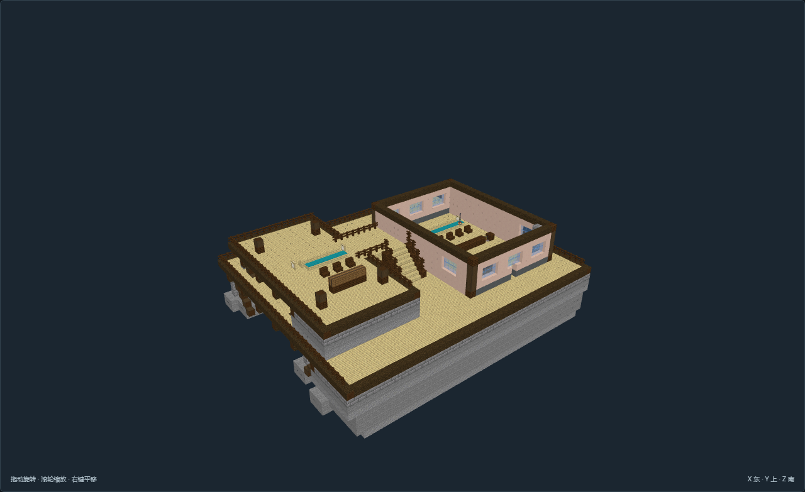

[作者标记](models/CN-F01-v07/author.json) · [完整验收 19图](models/CN-F01-v07/review.json)

### CN-F01-v08 · 小庭药材铺 · 空港日常小商铺

药材配料与咨询记录分为两翼，内庭展示四类盆栽样本；不宣称新增药材作物或治疗机制。

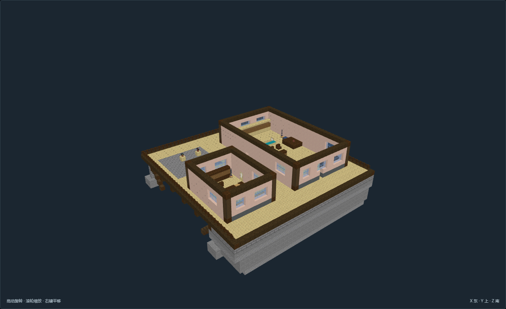

[作者标记](models/CN-F01-v08/author.json) · [完整验收 19图](models/CN-F01-v08/review.json)

### CN-F02-v01 · 窄岩沿麦田 · 高原田槽

狭长岩沿采用两条麦田，中间三格通路，前后横向端路与连续边栏封边。

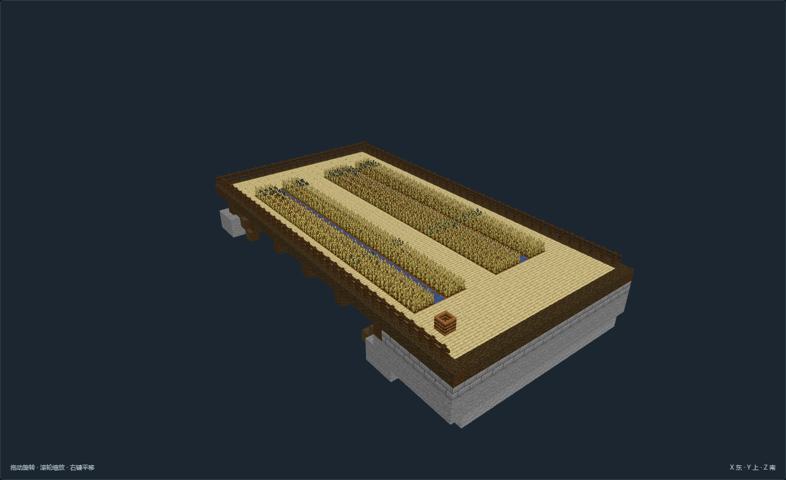

[作者标记](models/CN-F02-v01/author.json) · [完整验收 14图](models/CN-F02-v01/review.json)

### CN-F02-v02 · 双台胡萝卜畦 · 高原田槽

两块胡萝卜畦分别落在高差四格的实体台地，床边水渠独立、维护廊通过四级外阶连接。

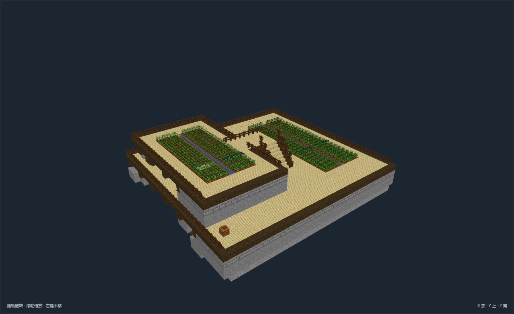

[作者标记](models/CN-F02-v02/author.json) · [完整验收 15图](models/CN-F02-v02/review.json)

### CN-F02-v03 · 九宫混植槽 · 高原田槽

九个独立小型槽床构成网格通路，各有封闭水源；适合多户共用菜槽，作物交错而非单一大田。

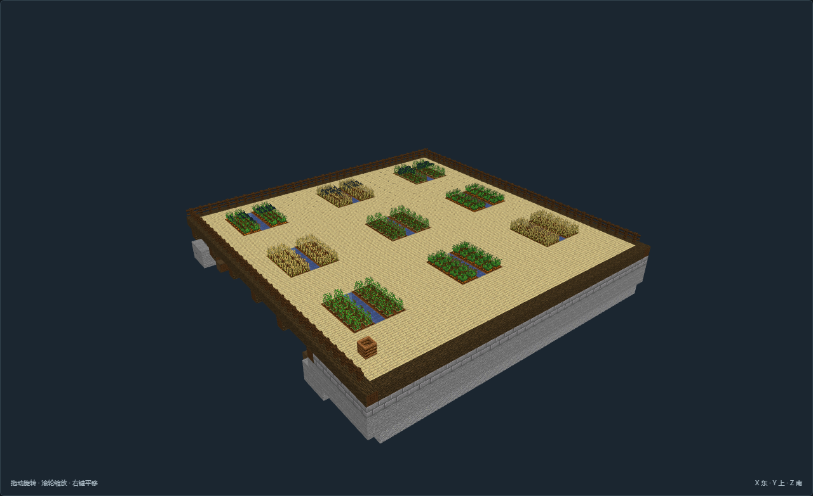

[作者标记](models/CN-F02-v03/author.json) · [完整验收 28图](models/CN-F02-v03/review.json)

### CN-F02-v04 · 折边甜菜圃 · 高原田槽

L形甜菜床沿两边围合维护小庭，内角设堆肥和歇脚位置；长边使用横向水渠覆盖整条。

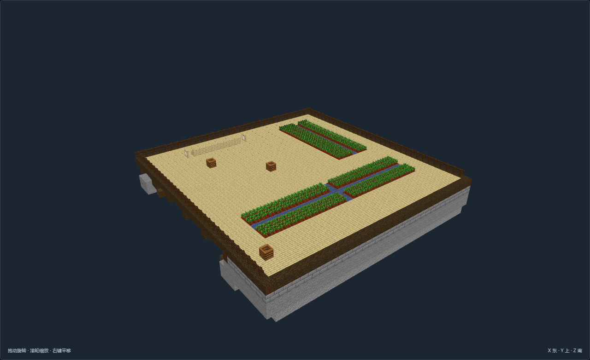

[作者标记](models/CN-F02-v04/author.json) · [完整验收 14图](models/CN-F02-v04/review.json)

### CN-F02-v05 · 种粮小庭院 · 高原田槽

中央通路把马铃薯和麦田分开，后端带一间独立农具留种房，形成可独立使用的小庭院。

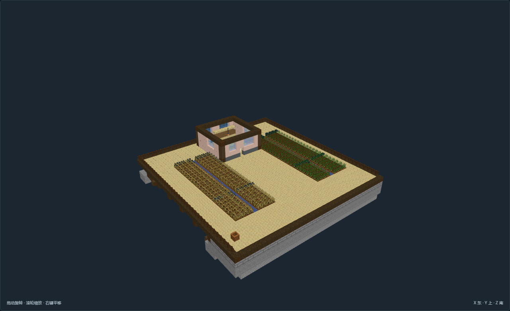

[作者标记](models/CN-F02-v05/author.json) · [完整验收 16图](models/CN-F02-v05/review.json)

### CN-F02-v06 · 阶带轮作田 · 高原田槽

三道横向石砌阶带按两格级差上升，作物轮作与横向水渠独立；东侧维护阶道串联各级。

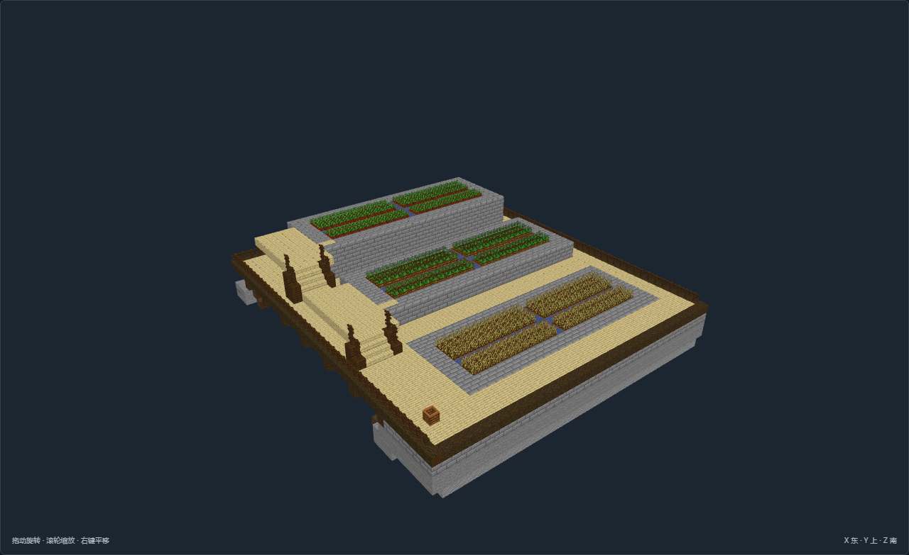

[作者标记](models/CN-F02-v06/author.json) · [完整验收 17图](models/CN-F02-v06/review.json)

### CN-F03-v01 · 背风单侧候棚 · 候行货棚

南侧半高挡风墙与朝北单侧候行区，长凳和行李架分列两端，适合背风的岩台小路口。

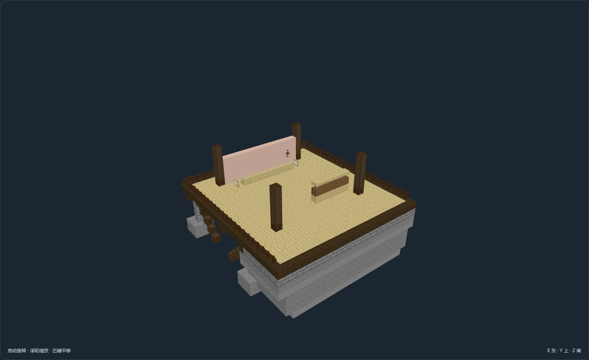

[作者标记](models/CN-F03-v01/author.json) · [完整验收 11图](models/CN-F03-v01/review.json)

### CN-F03-v02 · 贯通行李长棚 · 候行货棚

窄长贯通棚保持中央三格行进通道，候行座位和寄存货物错位放置，南北均可接续步道。

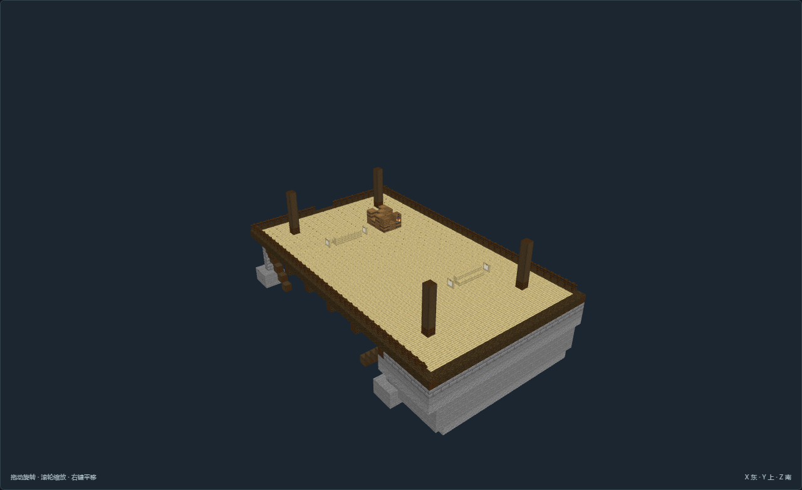

[作者标记](models/CN-F03-v02/author.json) · [完整验收 12图](models/CN-F03-v02/review.json)

### CN-F03-v03 · 折角换乘棚 · 候行货棚

长候行翼与短寄货翼折向围合转角中庭，候船与小货交接分开，适合两条步道汇合点。

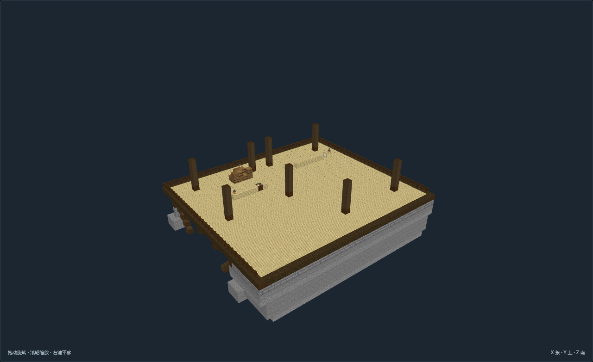

[作者标记](models/CN-F03-v03/author.json) · [完整验收 13图](models/CN-F03-v03/review.json)

### CN-F03-v04 · 附仓寄物棚 · 候行货棚

开放候行棚旁带封闭小寄物间，室外办理与室内存放独立，保留宽敞中间连接廊。

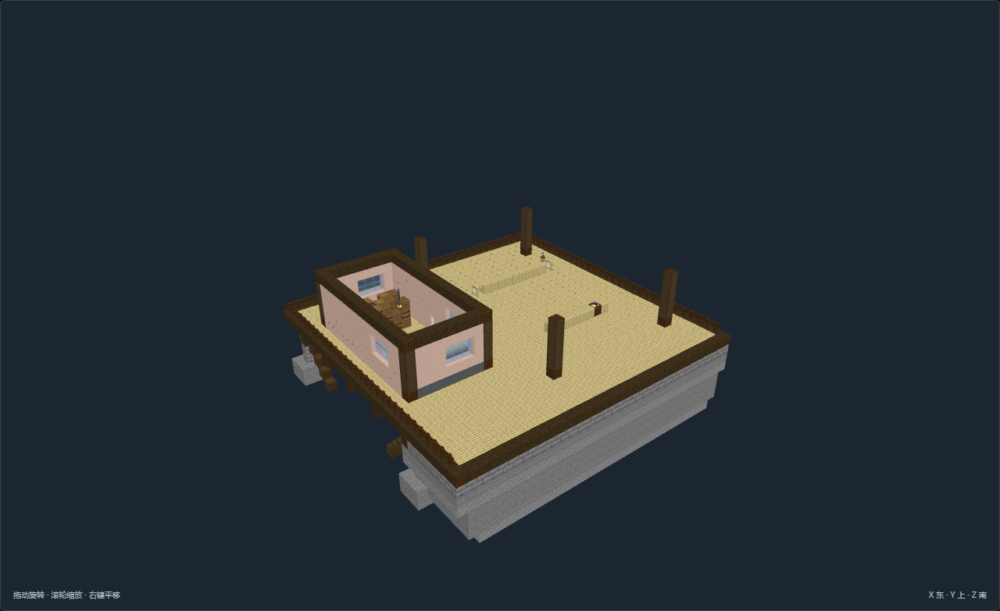

[作者标记](models/CN-F03-v04/author.json) · [完整验收 13图](models/CN-F03-v04/review.json)
