# 云海航行文明 · 核心验收画廊

[返回入口](README.md) · [核心清单](核心结构.md)

7 座核心/专项均已实际查看最终全视角与全部房间/使用点，共133张归档截图。这里挑选外观与剖面作快速浏览；完整截图和双哈希结论在各模型目录。

## CN-01-v01 · 峡谷冠台 · 飞空艇泊塔

候船和站务分置两翼，直上步梯连接12格高差；高架泊台的下层作为地面理货廊。 系留桅杆是静态设施，承台由四排柱梁传力到石墩；登船端仅短挑出六格。

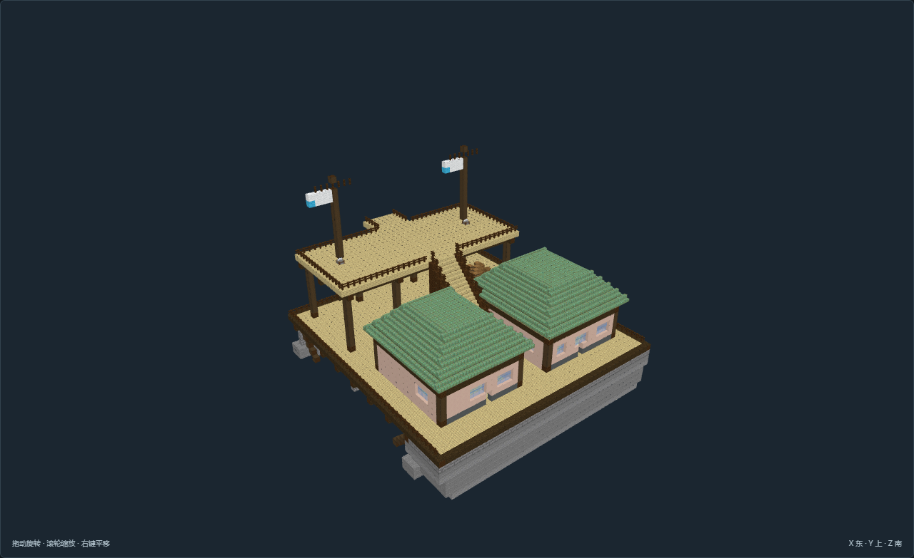
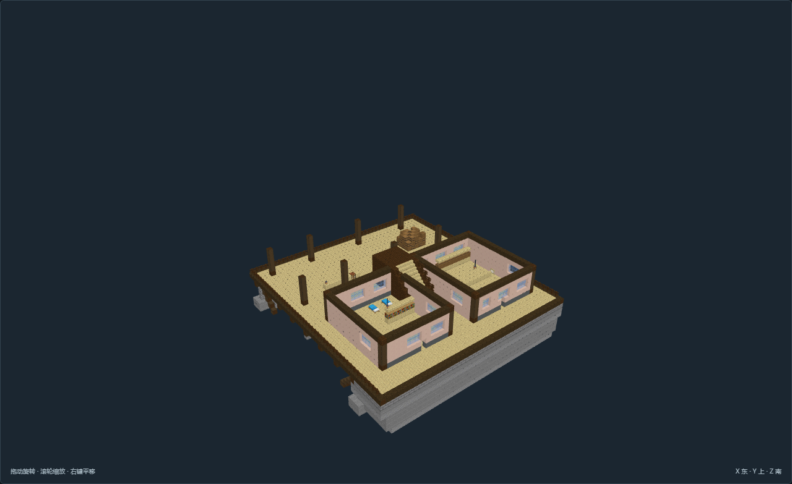

[完整作者记录](models/CN-01-v01/author.json) · [验收](models/CN-01-v01/review.json)

## CN-02-v01 · 双脊风帆库 · 船体修造库

开放端的长跨双脊屋盖与西侧两间低檐工作生活房形成体量层次。 船体为开放龙骨修造阶段；高原地面工厂，不假定整栋悬空或船坯可驾驶。

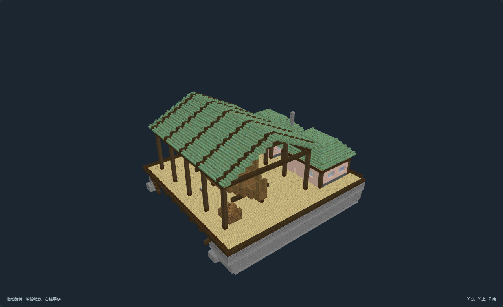
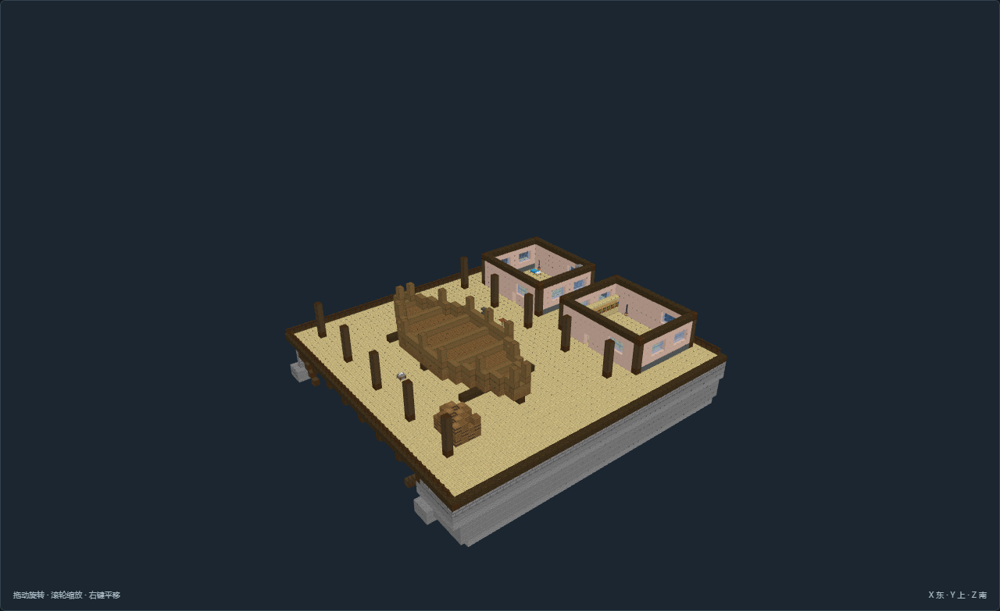

[完整作者记录](models/CN-02-v01/author.json) · [验收](models/CN-02-v01/review.json)

## CN-03-v01 · 折阶观风塔 · 风向导航塔

实体石塔与外置十二级步梯构成明确的观測高差；低层值守房沿北侧岩台布置。 风向旗与避雷外形是静态参考；只能在实际视线开阔、天气观测有需求的地方选用。

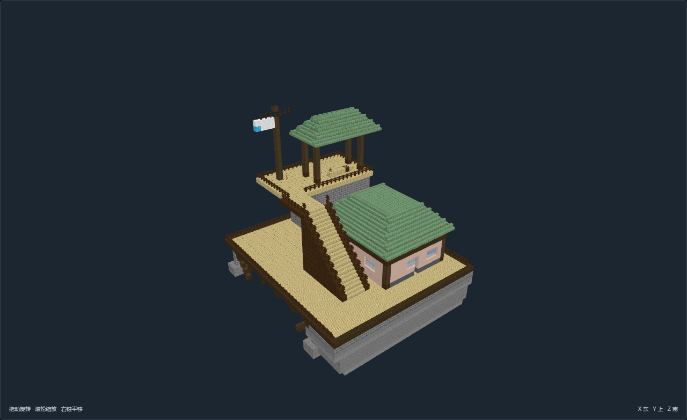
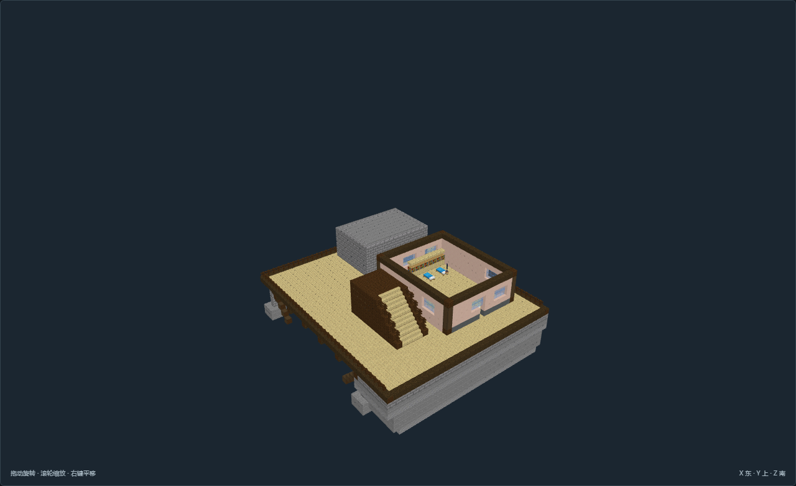

[完整作者记录](models/CN-03-v01/author.json) · [验收](models/CN-03-v01/review.json)

## CN-09-v01 · 三庭观云馆 · 气象学馆

教学与实验分列两翼，后部档案形成三面围庭；中庭仪器与高旗杆成为公共辨识点。 庭院不是已实现气象采样系统；选址应避开实际风雨遮蔽，书馆样本和观测机制另接。

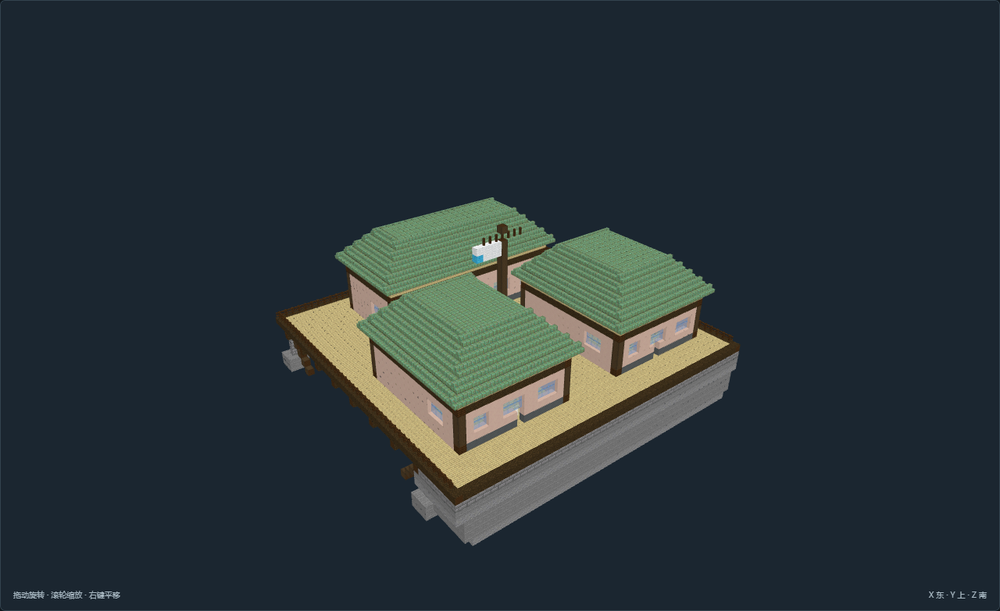
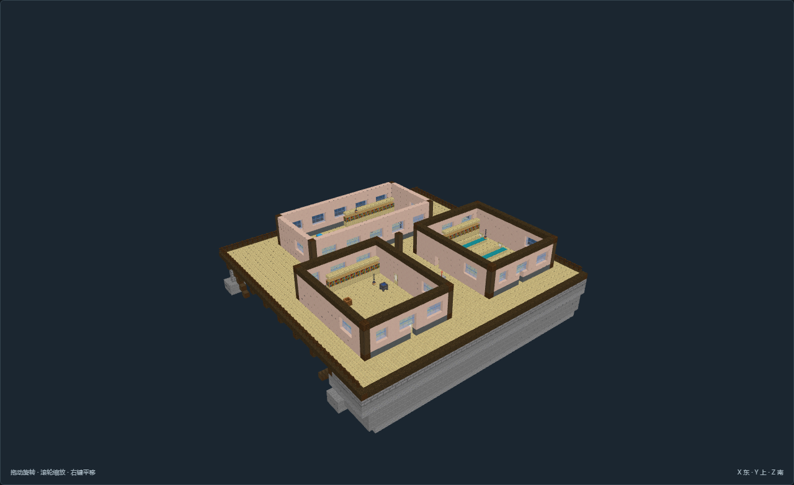

[完整作者记录](models/CN-09-v01/author.json) · [验收](models/CN-09-v01/review.json)

## CN-10-v01 · 双翼航图厅 · 航路议事所

高脊中厅、狭长档案与会客双翼、后庭凉廊构成公共院落。 桌面航图为静态陈设；本体不承诺航线管理或议事机制。

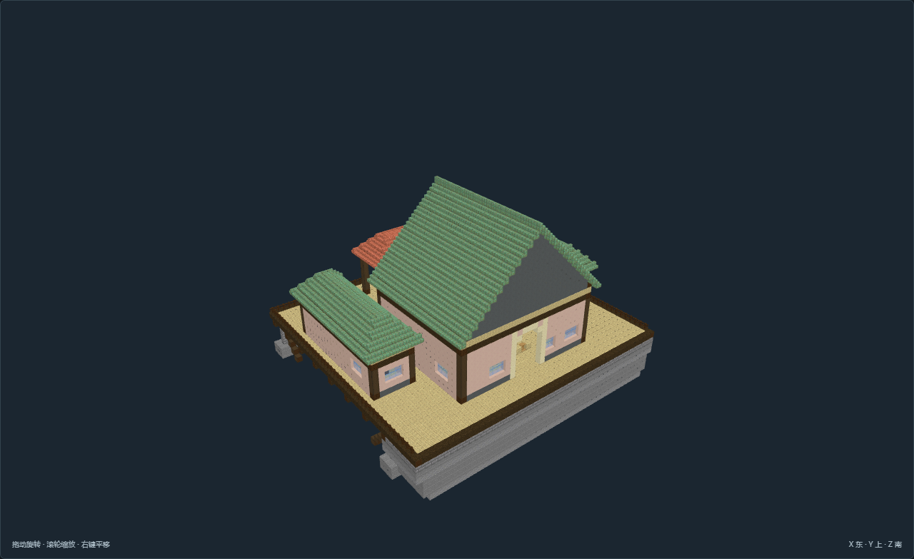
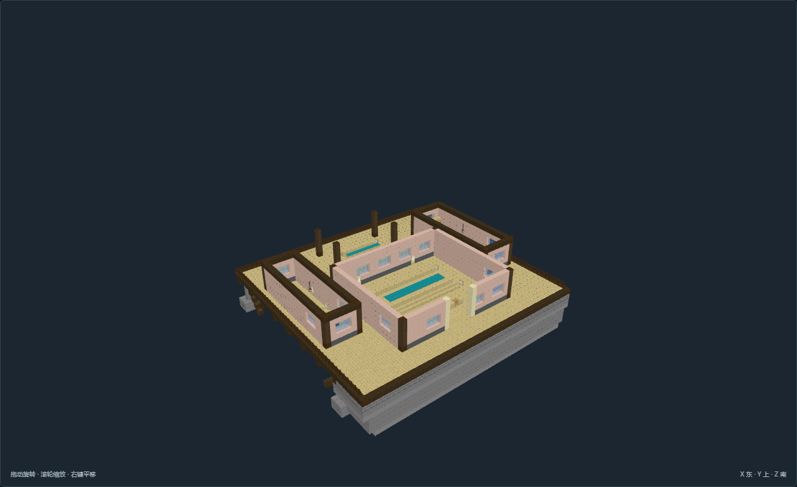

[完整作者记录](models/CN-10-v01/author.json) · [验收](models/CN-10-v01/review.json)

## CN-11-v01 · 断缆旧站 · 废弃泊塔

废弃状态来自断链、拆除的登船端、后部破板和封边，不牺牲仍可探索的旧站务室。 只在航路改变的历史节点明确选用；破损区不可作为运行中的泊位。

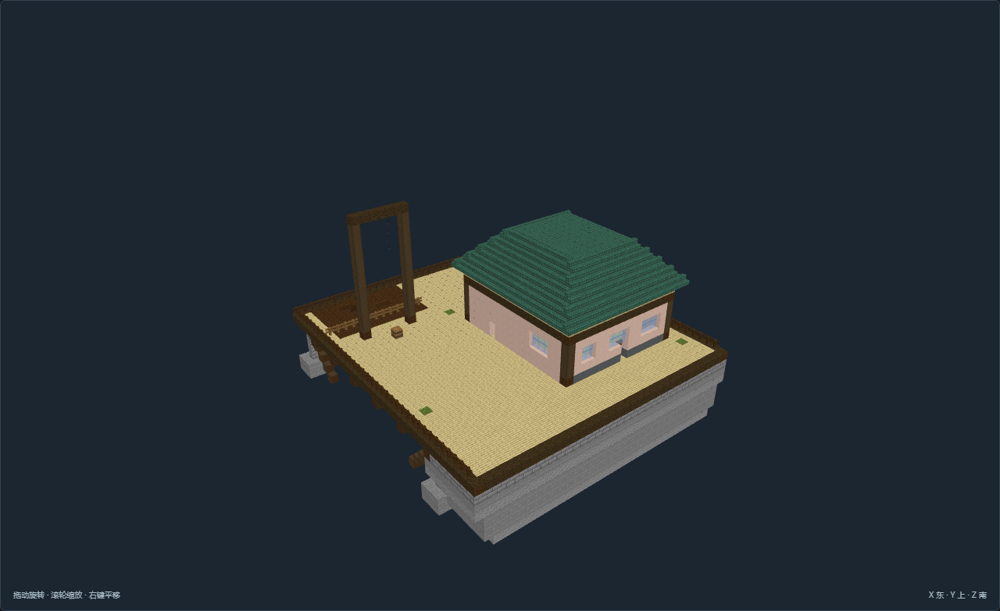
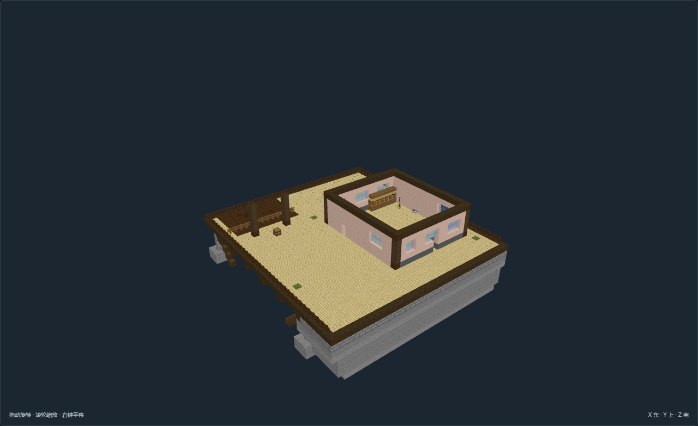

[完整作者记录](models/CN-11-v01/author.json) · [验收](models/CN-11-v01/review.json)

## CN-12-v01 · 岩坳折翼营 · 坠落船骸回收营

住宿、分拣棚与偏折船骸形成三块独立作业空间；外缘木台由实体岩坳承接。 船骸是预制静态情景，不能宣称模拟过坠落；实地地形和历史来源必须匹配。

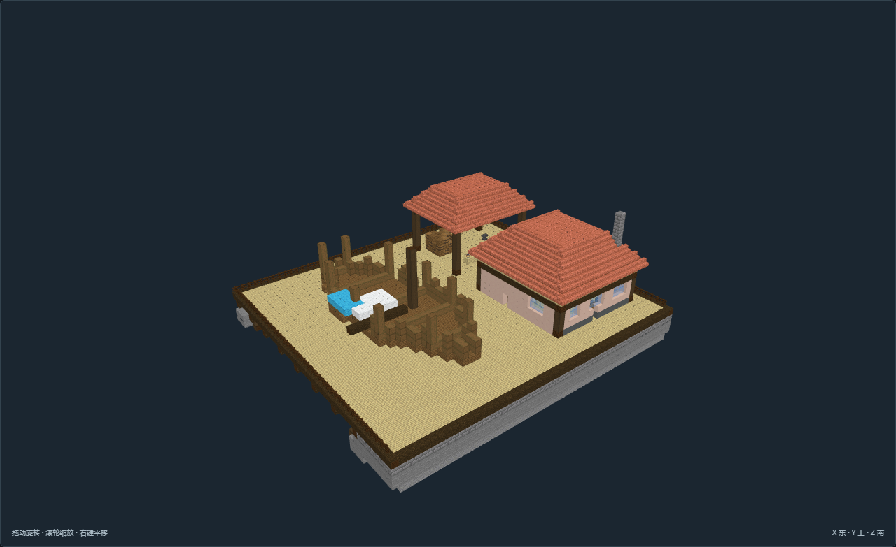
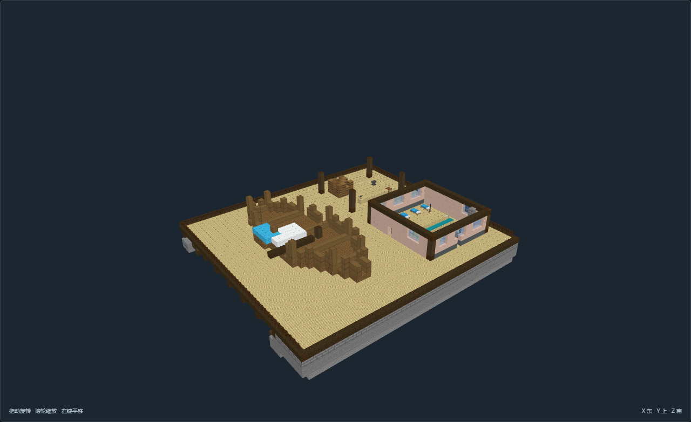

[完整作者记录](models/CN-12-v01/author.json) · [验收](models/CN-12-v01/review.json)
