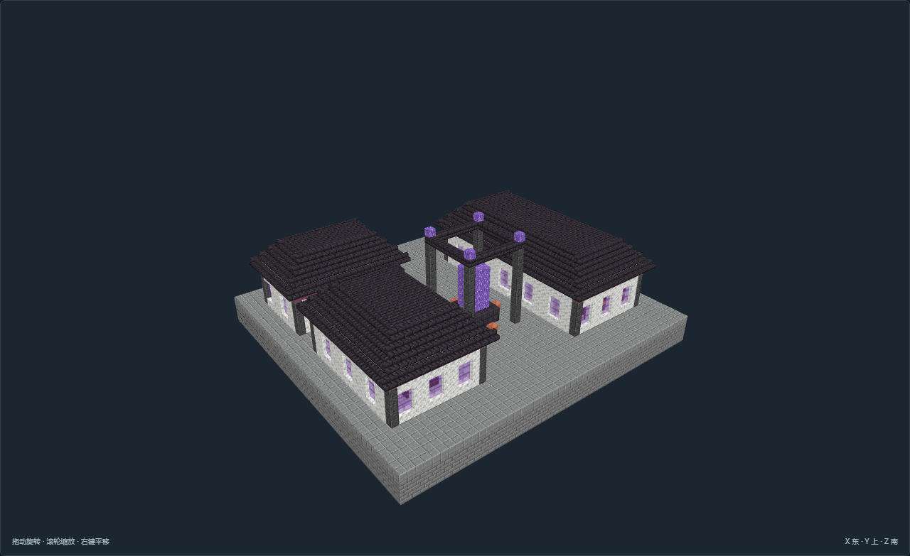
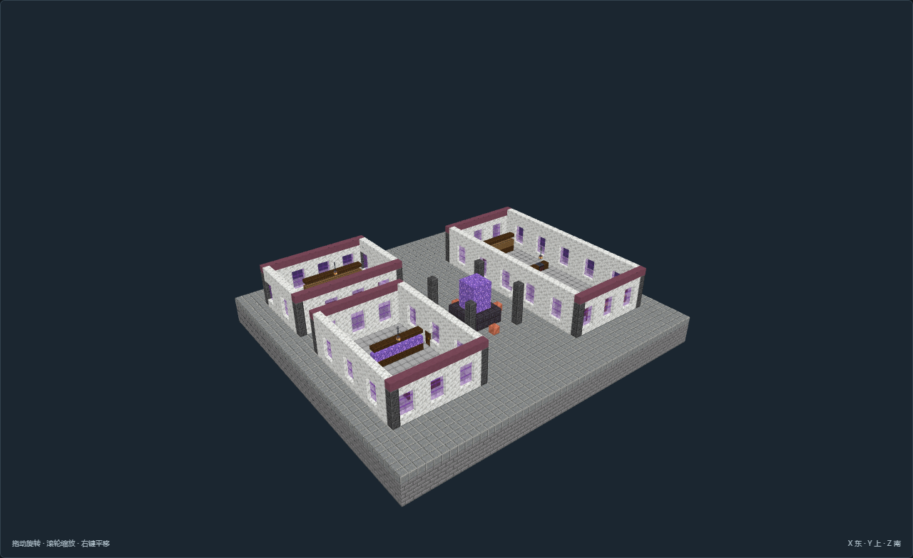

# AA-03-v01 四柱晶核庭 · 魔力配给所

[返回文明入口](../../README.md) · [核心清单](../../建筑清单.md)

尺寸（X × Y × Z）：51 × 33 × 47。角色：`planning_role.key`。作者离线验收完成并冻结，最终视图 22 张。

管理与维修长翼：配额管理、账本、维修长台与备件；晶石分类仓：两排封存晶石架，搬运间距清楚；配给接口工间：计量外形、检修台、工具与接口预留。

## 因地制宜

**选址**：靠近学城设施的维护街区，基础避开地下水，预留普通装卸路和地下接口

**高程**：主地板Y=3，普通道路脚底接Y=4；基础底Y=0须落在连续承载地层

**地形处理**：模板是人工整平石基，不适用于未经处理的峡谷、水域或陡坡。观测馆上台阶为模板内实体台地。

**接驳**：南北朝向以作者入口标记为准；外部道路、服务范围和供能管线另行核对。

**魔法边界**：紫晶、终界烛、传送环、隔离屏与供能接口仅为静态原版陈设，不代表传送、供能、治疗或异常模拟。

## 数据与证据

[NBT](structure.nbt) · [作者标记](author.json) · [数据和导航验证](validation.json) · [实看验收](review.json) · [截图与双哈希](previews/capture.json)

所有房间、功能点和入口随作者标记保存；导航零警告。离线预览不证明真实地图生成或运行时机器行为。源码：`tools/structure_studio/studio/arcane_academy.py`。

在 `tools/structure_studio` 运行 `python -m studio.build AA-03-v01` 可从源码重建。
