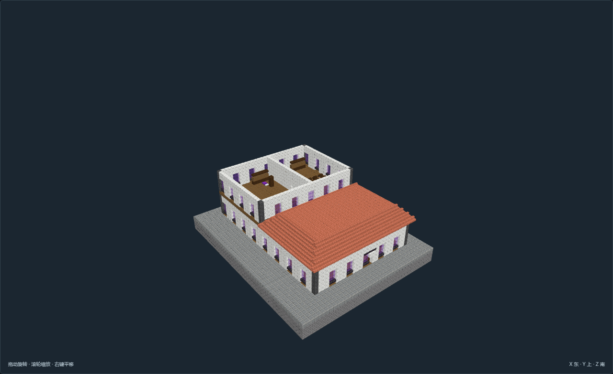

# AA-F01-v05 双间日用器皿铺 · 长铺后部夹层

[返回填充清单](../../建筑清单.md)

尺寸X×Y×Z：44 × 42 × 53；角色：`planning_role.fill`。作者返工实看发布，待主审复核；最终证据27张。

长铺后部夹层；日用器皿分层陈列、配货与修补；连通主体、分室生活与行业工位；依据街面、楼层或内庭组织真实流线，不以独栋位置互换作为变体。

## 空间与用途

交易陈列与专业工作间：日用器皿分层陈列、配货与修补；接单、原料、主次操作和成品分区

夹层下生产作间：后部加工长案与成品柜；东侧室内楼梯上夹层

店主餐厨起居：完整备餐、就餐、坐读和食品存放

隔门店主寝室：个人床柜、书写、衣物和盥洗

## 适用条件

选址：干燥稳定的学院街区；石基落连续承载层，北侧接普通步行街道

高程：主地板Y=3，普通道路脚底接Y=4；基础底Y=0须落在连续承载地层

地形处理：模板是人工整平石基，不适用于未经处理的峡谷、水域或陡坡。观测馆上台阶为模板内实体台地。

接驳：南北朝向以作者入口标记为准；外部道路、服务范围和供能管线另行核对。

魔法边界：紫晶、终界烛、传送环、隔离屏与供能接口仅为静态原版陈设，不代表传送、供能、治疗或异常模拟。

## 验证与预览

[NBT](structure.nbt) · [作者标记](author.json) · [数据与导航](validation.json) · [实看记录](review.json) · [截图双哈希](previews/capture.json)

数据和导航零警告。未运行MC；地形预览为适用条件示意，不证明生长、流体、机器或运行时生成。

