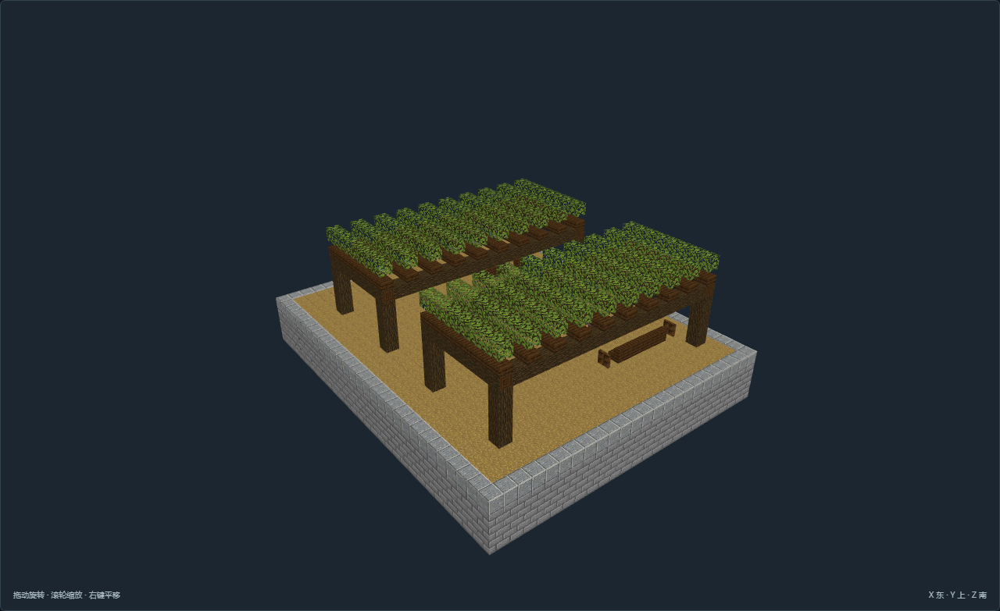
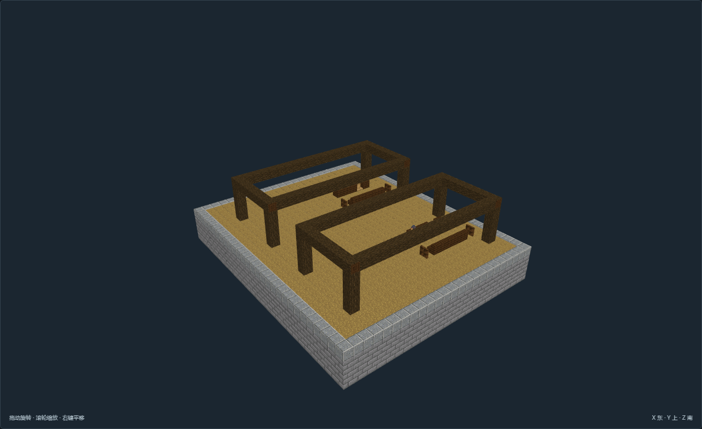

# AA-F03-v03 双列交流藤庭

[返回填充清单](../../建筑清单.md)

尺寸X×Y×Z：28 × 26 × 33；角色：`planning_role.fill`。作者离线实看发布，最终证据13张。

双列交流藤庭；纯遮蔽休憩型：叶冠仅为固定装饰，坐读交流；架形和组数不同；无葡萄或自动生长声明。

## 空间与用途

开放架下休憩：端部坐席和桌台，中间连续通行

开放架下休憩：端部坐席和桌台，中间连续通行

## 适用条件

选址：稳定干燥的学院生活街区；整块人工石基，外部道路接普通步行入口

高程：主地板Y=3，普通道路脚底接Y=4；基础底Y=0须落在连续承载地层

地形处理：模板是人工整平石基，不适用于未经处理的峡谷、水域或陡坡。观测馆上台阶为模板内实体台地。

接驳：南北朝向以作者入口标记为准；外部道路、服务范围和供能管线另行核对。

魔法边界：紫晶、终界烛、传送环、隔离屏与供能接口仅为静态原版陈设，不代表传送、供能、治疗或异常模拟。

模板落地：基础Y=0..2落在连续承载层；不是自然坡地自适应，不用于未经整平的岸边与水面。

农业落地：固定模板内人工土床与边框，需稳定平地、采光、可用灌溉水和常规气候；自然连片田仍交Landscape，不宣称药效。

作物边界：仅使用原版作物或观赏花草；不是葡萄种植或整合包药材机制。实际生长条件与整合包种类另行接入。

## 验证与预览

[NBT](structure.nbt) · [作者标记](author.json) · [数据与导航](validation.json) · [实看记录](review.json) · [截图双哈希](previews/capture.json)

数据和导航零警告。未运行MC；地形预览为适用条件示意，不证明生长、流体、机器或运行时生成。

