# 魔法学院核心验收画廊

[返回入口](README.md) · [核心清单](核心结构.md)

7 个核心/专项模型，161 张最终浏览器视图全部由作者实看并发布。仅离线资产验收，未运行 MC。填充结构未制作。

## AA-01-v01 三门环庭 · 传送驿站

[模型说明](models/AA-01-v01/README.md) · [全部证据](models/AA-01-v01/review.json)

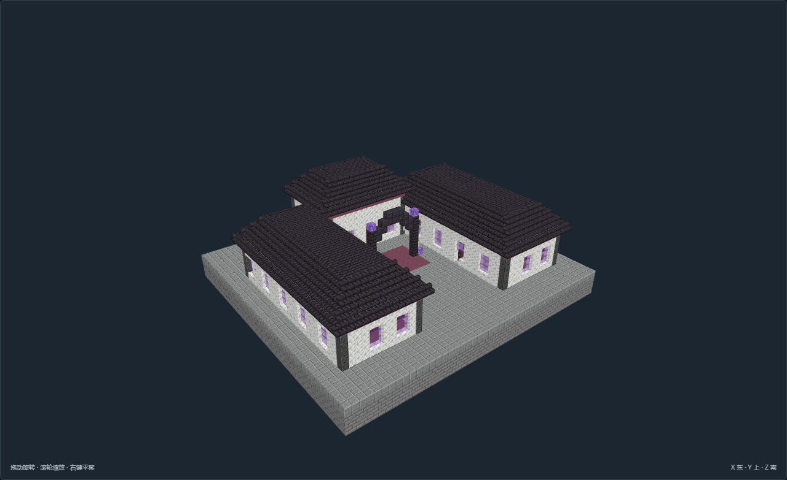

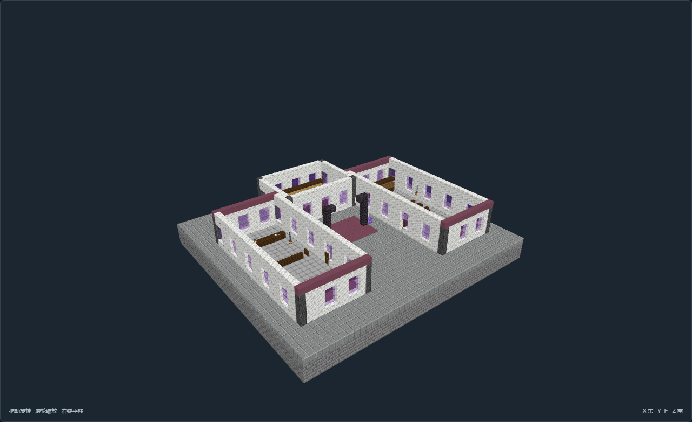

## AA-02-v01 梳齿清检院 · 传送检疫所

[模型说明](models/AA-02-v01/README.md) · [全部证据](models/AA-02-v01/review.json)

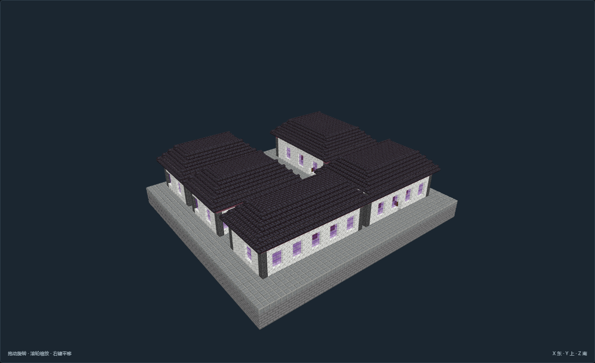

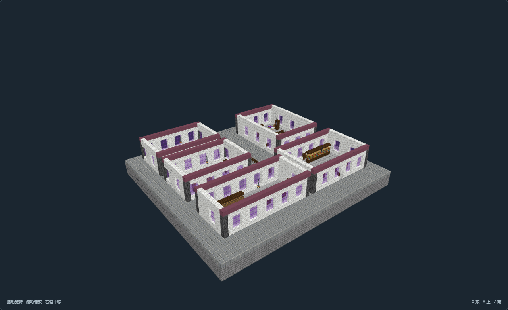

## AA-03-v01 四柱晶核庭 · 魔力配给所

[模型说明](models/AA-03-v01/README.md) · [全部证据](models/AA-03-v01/review.json)

## AA-04-v01 四课庭院 · 魔导学院

[模型说明](models/AA-04-v01/README.md) · [全部证据](models/AA-04-v01/review.json)

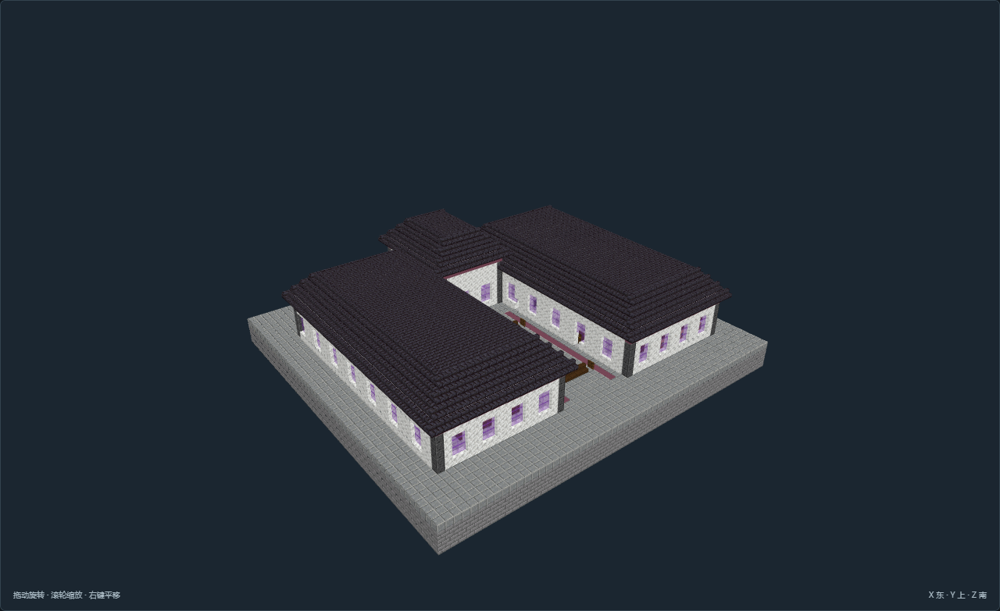

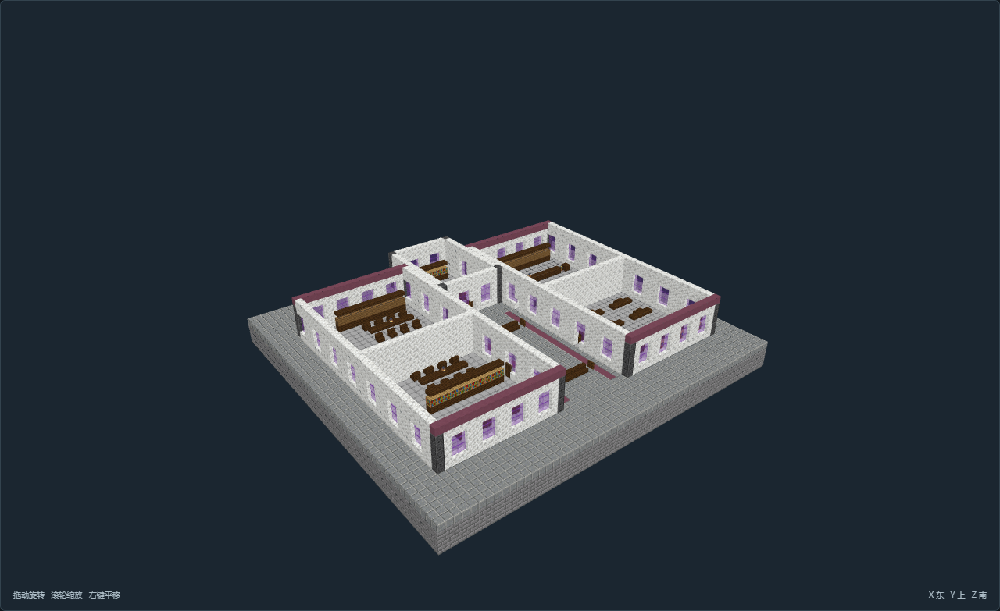

## AA-09-v01 十字卷藏馆 · 术式图书馆

[模型说明](models/AA-09-v01/README.md) · [全部证据](models/AA-09-v01/review.json)

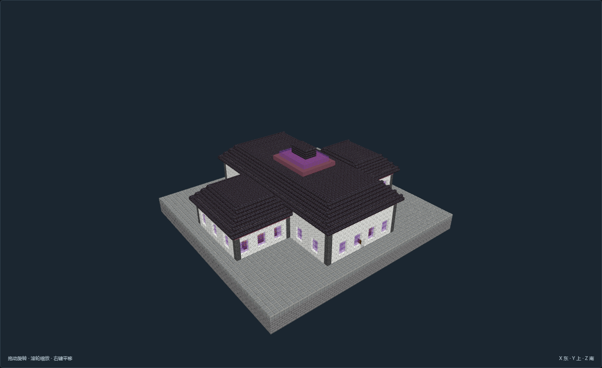

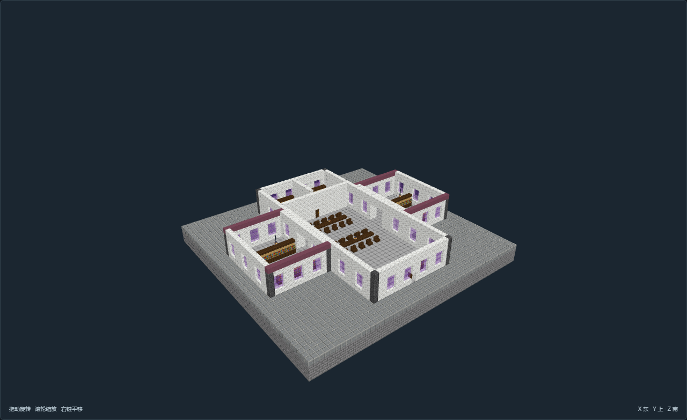

## AA-11-v01 断环旧驿 · 失效古代传送站

[模型说明](models/AA-11-v01/README.md) · [全部证据](models/AA-11-v01/review.json)

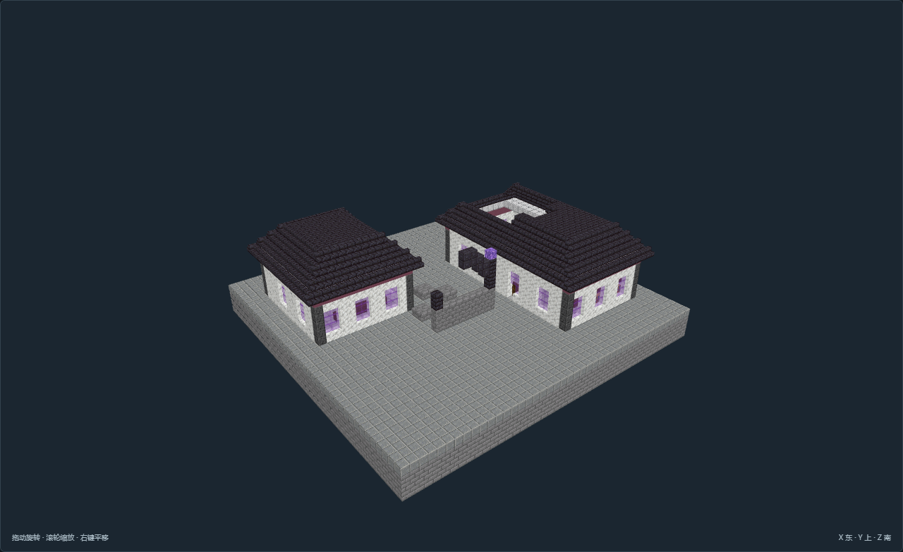

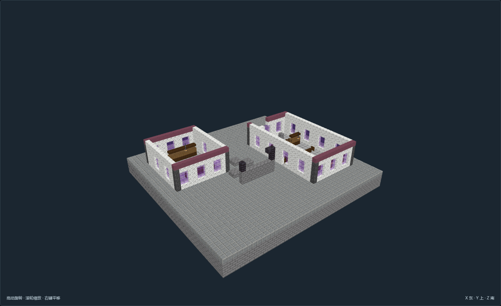

## AA-12-v01 阶台隔距馆 · 异常观测馆

[模型说明](models/AA-12-v01/README.md) · [全部证据](models/AA-12-v01/review.json)

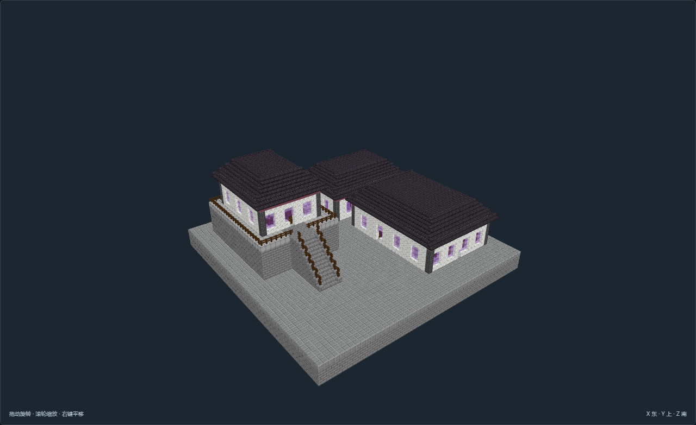

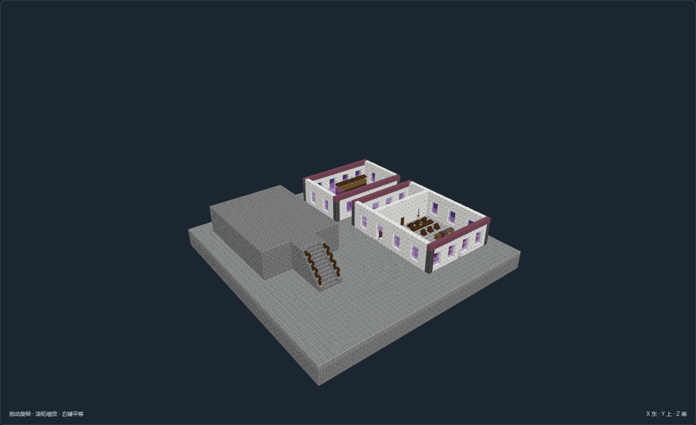
