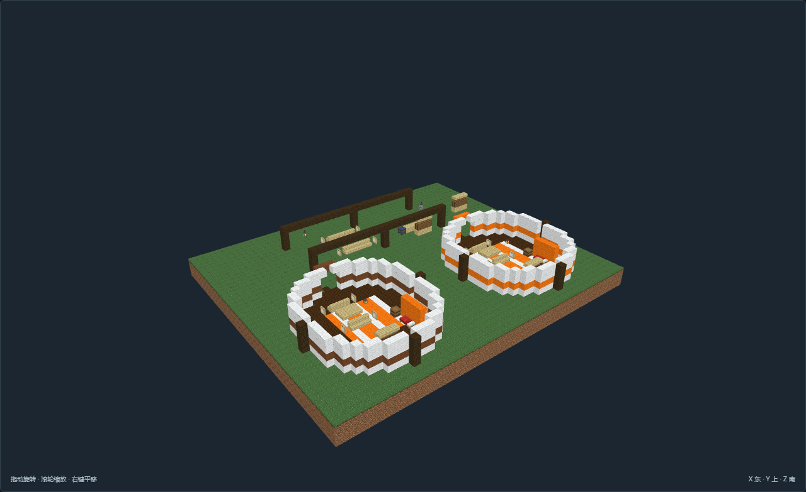

# SC-04-v04 · 双帐共享炊庭

[返回填充清单](../../建筑清单.md)

游牧生活返修版；作者全图实看完成，**待主审交叉复核**。尺寸 53×19×45，当前证据 23 张；旧版同构平面已撤回。

双帐共享炊庭；以火塘、床榻、厨房和公共空间关系决定平面，浅木家具与织毯区分功能。

| 分区 | 实际组织 |
| --- | --- |
| 独立寝居帐 | 寝居与家户用品独立，炊事集中院内公共棚 |
| 独立寝居帐 | 寝居与家户用品独立，炊事集中院内公共棚 |
| 双帐共享炊庭 | 两帐之间及前庭形成环行交往空间，公共厨房不复制进每个帐 |

功能点包括：abed、acloth、asit、bbed、bcloth、bsit、sharedkcook、sharedkwater、sharedkfood、sharedmeal、tools、entry。浅木操作桌、衣物柜与深木地面形成对比，织毯界定生活区，短屏保护床侧视线。

选址与落地：背风稳定营地，按具体帐群占地接已有营路；双帐共享炊庭；须接已有水草与补给路线，储槽为外部运水；按当地风向使入口背风，长季定居与短期停驻明确区分。；默认入口脚底Y=3；坡台住宅Y=5由实体台阶接入，见点位。；仅整理模板营地占地，不推平外部草坡；留出畜群、货车或来客外接通路。；原版静态空间与作者点位，未接入动物、交易、季节迁徙或运行时生成。

[作者标记](author.json) · [NBT](structure.nbt) · [当前截图清单](previews/capture.json) · [作者图审](review.json)。当前NBT和作者标记双哈希与证据一致；确定性重建、数据与离线步行零警告。未启动MC，尚未接入运行时。

