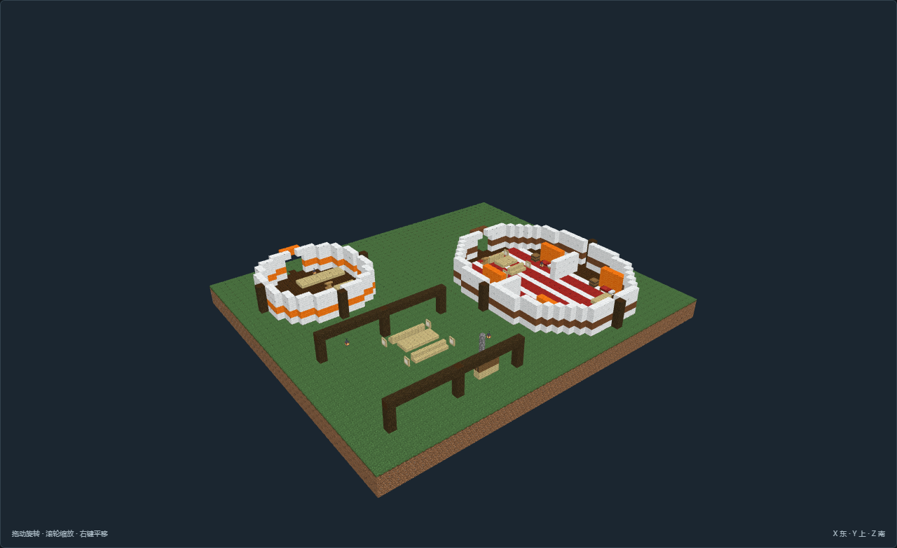

# SC-09-v04 · 客宿长帐与接待小帐

[返回填充清单](../../建筑清单.md)

游牧生活返修版；作者全图实看完成，**待主审交叉复核**。尺寸 55×19×48，当前证据 26 张；旧版同构平面已撤回。

客宿长帐与接待小帐；独立客帐、共宿舱、餐帐与接待帐按服务组织分别组合。

| 分区 | 实际组织 |
| --- | --- |
| 独立旅人寝帐 | 只含休息、衣物、读写，避免将家庭厨房复制进每个客帐 |
| 公共餐饮棚 | 多床客帐的食物处理与餐席外置，后侧接待小帐处理行李 |
| 独立接待小帐 | 集中登记、床品与行李整理，不与睡眠流线混用 |

功能点包括：dormbed、dormbed2、dormbag、dormpacking、dormread、rearleft、rearright、servicekcook、servicekwater、servicekfood、servicemeal、hoststock、host、luggage、entry。浅木操作桌、衣物柜与深木地面形成对比，织毯界定生活区，短屏保护床侧视线。

选址与落地：路线补给节点，入口避开牲畜与货车主路；客宿长帐与接待小帐；须接已有水草与补给路线，储槽为外部运水；按当地风向使入口背风，长季定居与短期停驻明确区分。；默认入口脚底Y=3；坡台住宅Y=5由实体台阶接入，见点位。；仅整理模板营地占地，不推平外部草坡；留出畜群、货车或来客外接通路。；原版静态空间与作者点位，未接入动物、交易、季节迁徙或运行时生成。

[作者标记](author.json) · [NBT](structure.nbt) · [当前截图清单](previews/capture.json) · [作者图审](review.json)。当前NBT和作者标记双哈希与证据一致；确定性重建、数据与离线步行零警告。未启动MC，尚未接入运行时。

