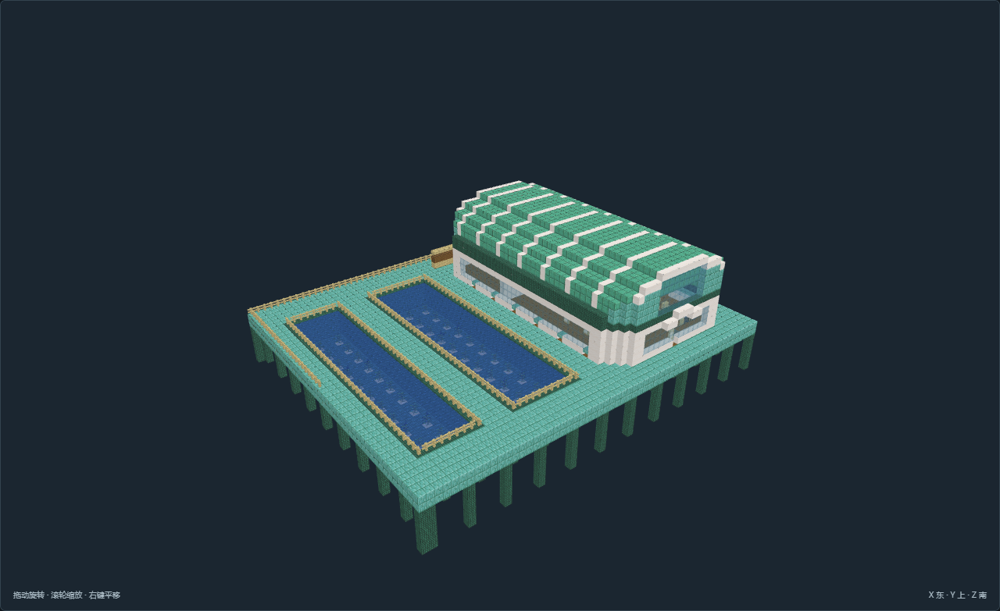
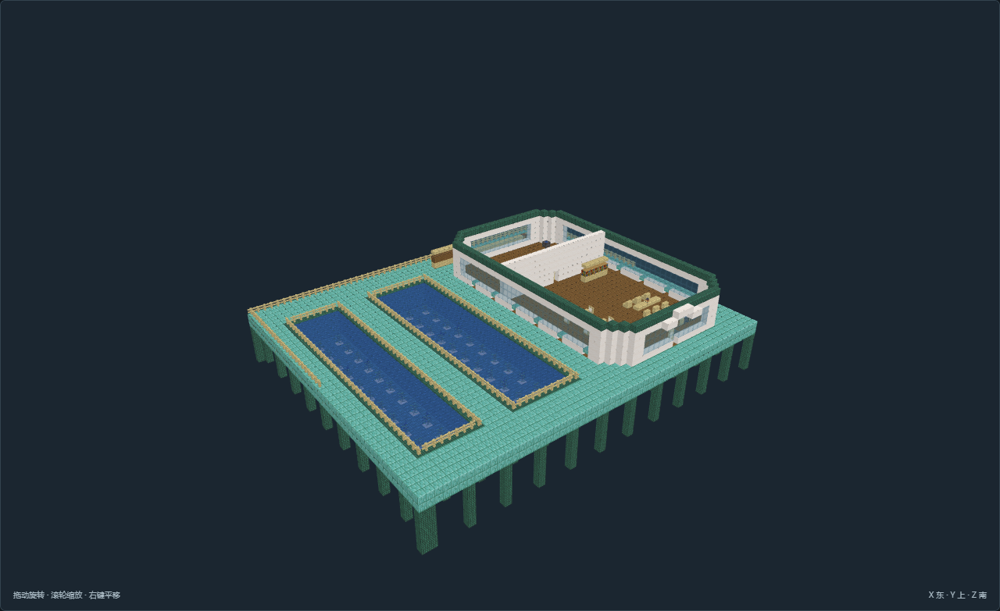

# TC-04-v01 长槽管理贝屋

[返回填充清单](../../建筑清单.md)

尺寸X×Y×Z：61 × 36 × 51；角色：`planning_role.fill`。作者实看发布，待主审复核；最终证据23张。

长槽管理贝屋；两条纵长槽共用岸侧生活房。

## 空间与用途

厨房餐读起居：完整厨房、食品柜、共餐桌椅、相向读书座与书物柜

隔门干式卧室：床位与个人灯柜、衣物储藏、写字和盥洗，实体隔门

海带育苗槽：沙底水槽种植原版海带；干燥围护通道人工维护，不模拟流体与自动收获

海带育苗槽：沙底水槽种植原版海带；干燥围护通道人工维护，不模拟流体与自动收获

## 适用条件

选址：避风潮上岸台或人工桩台；水侧支柱底Y=0必须接稳定海床，不自动适应任意水深

潮位：低潮Y=3、参考水面Y=5、预期高潮Y=6；主层干地板Y=7、脚底Y=8，潮汐仅为条件记录

支撑接驳：北侧接Y=8普通步行道路；所有楼梯为实体台阶。高层与分台另有房间高程，不依赖跳跃或游泳

供水生活：厨房淡水和食物依岸上补给；海水不能视为饮用或灌溉水。居室采用干燥外壳，气候通风与实际水密另验

风格：棱面近似贝壳的弧顶、放射或分瓣舱室、青绿石质桩台；风格不是国名

限制：原版静态模型；不代表潮汐、潜水呼吸、流体、生产或运行时生成已接入

水产条件：育苗池水体为静态原版海带示例；池底有沙与连续水柱，人工分批维护。投放时需核对实际水温、水交换、污染和运行时邻居更新。

## 验证与预览

[NBT](structure.nbt) · [作者标记](author.json) · [数据与导航](validation.json) · [实看记录](review.json) · [截图双哈希](previews/capture.json)

数据和导航零警告。未运行MC；地形预览为适用条件示意，不证明生长、流体、机器或运行时生成。

