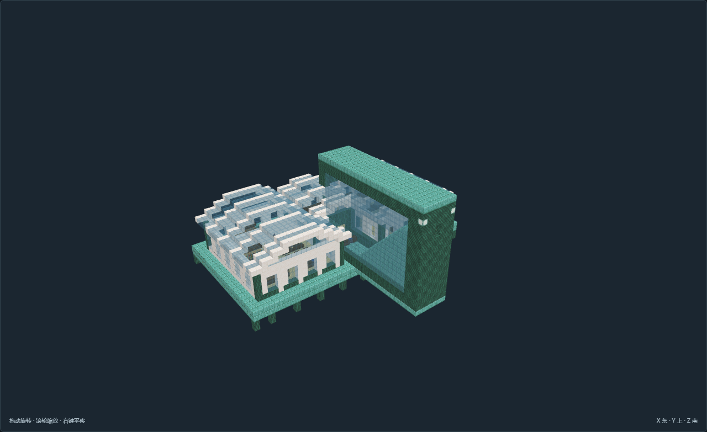
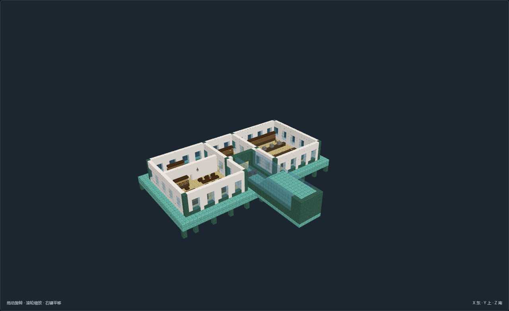

# TC-08-v01 玻璃双舱 · 水下考察站

[返回核心清单](../../核心结构.md)

尺寸X×Y×Z：53 × 28 × 46；角色：`planning_role.key`。主审完成离线全图验收，最终证据27张。

海床双低矮玻璃舱分隔研究和生活，独立高出高潮的入站井以实体楼梯接驳；水下功能点都在干燥舱内。

## 造型与陈设

低矮透明拱舱以白肋分段，研究、装备和生活分舱；海洋标本置于实际操作台面，不与餐饮混放。

## 空间与用途

干式样本研究舱：分样清洗、分析双台与分类样本柜

中央装备交接舱：潜水装具柜、检查长案与两侧舱门，保留绕台通道

驻留生活舱：储备淡水、成套备餐餐席、隔门双床与个人柜

封闭干式下行通道：从高潮以上平台下降至水下舱的实体楼梯；玻璃外壳水密待运行时核对

## 适用条件

选址：避风浅海、潮间带与稳定岸台；模板柱脚Y=0须接连续承载海床，不能悬空生成

潮位：本模型参考静水面Y=14，低潮Y=12，预期高潮Y=15；不是潮汐模拟，实际浪高及风暴增水另核对

干湿区：海床舱地板Y=3，双拱形透明舱顶最高Y=13；参考水面Y=14，低潮12/高潮15。北端Y=17平台经封闭楼梯接入干舱；低潮可露出部分舱顶，水密与呼吸玩法另验证。

接驳：北侧为陆路或干式栈桥入口；水侧作业接口不替代普通步行路线，船舶吃水与上下船机制另接

供给：淡水由岸上补给或收集后处理；水盆与食品柜表达储备，不假定海水可饮用；驻留与生产均需岸上补给

边界：原版静态珊瑚色建材与海洋设备陈设；不证明潮门、潜水、呼吸、流体或机器已运行

风格表达：海洋幻想：贝壳弧顶、浅色壳肋、青绿耐候表面与独立水陆空间；不将风格名直接当作选址条件。

## 验证与预览

[NBT](structure.nbt) · [作者标记](author.json) · [数据与导航](validation.json) · [实看记录](review.json) · [截图双哈希](previews/capture.json)

数据和导航零警告。未运行MC；地形预览为适用条件示意，不证明生长、流体、机器或运行时生成。

