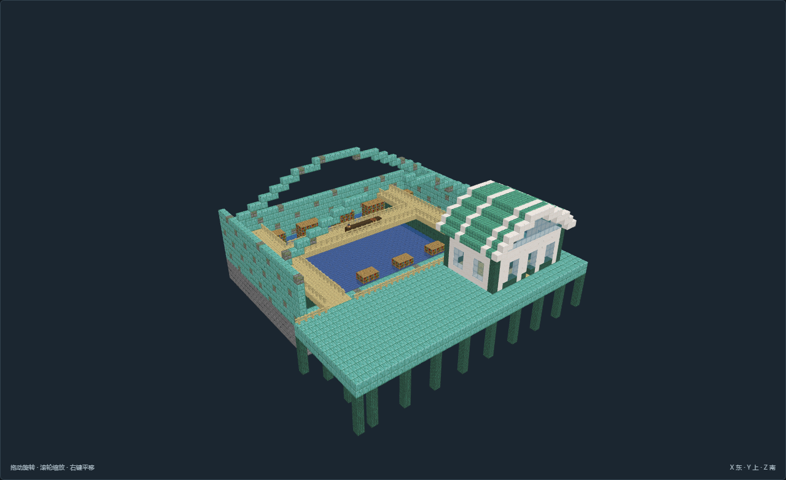
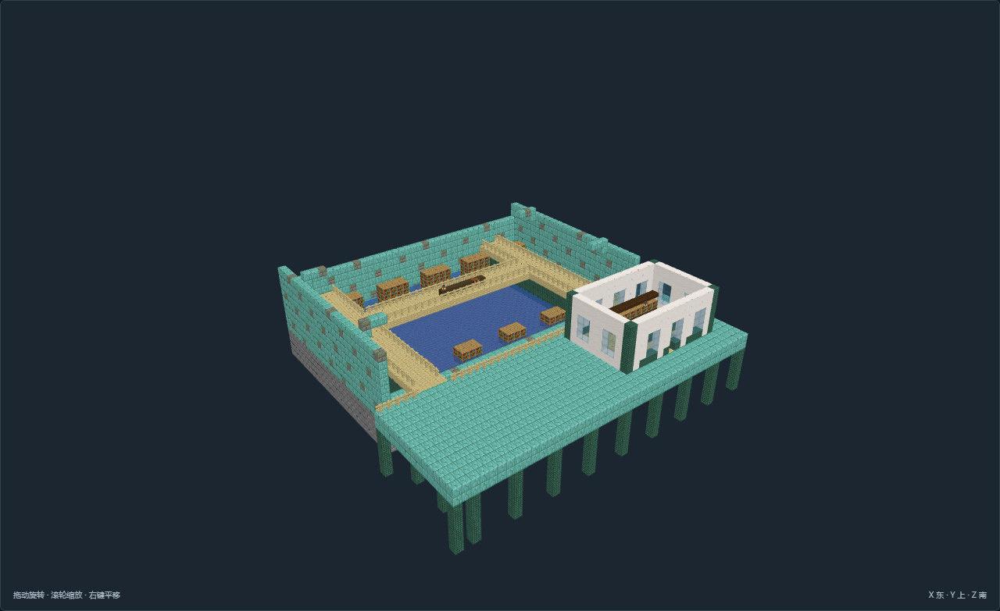

# TC-11-v01 回水残藏 · 淹没档案馆

[返回核心清单](../../核心结构.md)

尺寸X×Y×Z：47 × 34 × 47；角色：`planning_role.structure`。主审完成离线全图验收，最终证据16张。

前部增建干燥办公室接双纵高桥，旧档案层实际保留浅水与低书柜；断墙与缺屋盖揭示淹没历史，抢救路线不依赖游泳。

## 造型与陈设

淹没旧馆保留断裂壳肋、潮湿斑驳墙体和低位书柜；新建干燥登记屋与架空抢救桥区别于旧层。

## 空间与用途

增建干燥登记室：灾后办公室、抢救图志与清点长案

淹没旧藏区：旧低地板与浸水书柜；只从抬高木桥观察，不把涉水当普通通路

灾后高架抢救桥：双纵桥与横向转运桥，连续侧栏防落入旧层

## 适用条件

选址：避风浅海、潮间带与稳定岸台；模板柱脚Y=0须接连续承载海床，不能悬空生成

潮位：本模型参考静水面Y=5，低潮Y=3，预期高潮Y=6；不是潮汐模拟，实际浪高及风暴增水另核对

干湿区：常用干地板Y=7、步行脚底Y=8；指定水槽与历史淹没区例外，入口以标记为准

接驳：北侧为陆路或干式栈桥入口；水侧作业接口不替代普通步行路线，船舶吃水与上下船机制另接

供给：淡水由岸上补给或收集后处理；水盆与食品柜表达储备，不假定海水可饮用；驻留与生产均需岸上补给

边界：原版静态珊瑚色建材与海洋设备陈设；不证明潮门、潜水、呼吸、流体或机器已运行

风格表达：海洋幻想：贝壳弧顶、浅色壳肋、青绿耐候表面与独立水陆空间；不将风格名直接当作选址条件。

## 验证与预览

[NBT](structure.nbt) · [作者标记](author.json) · [数据与导航](validation.json) · [实看记录](review.json) · [截图双哈希](previews/capture.json)

数据和导航零警告。未运行MC；地形预览为适用条件示意，不证明生长、流体、机器或运行时生成。

