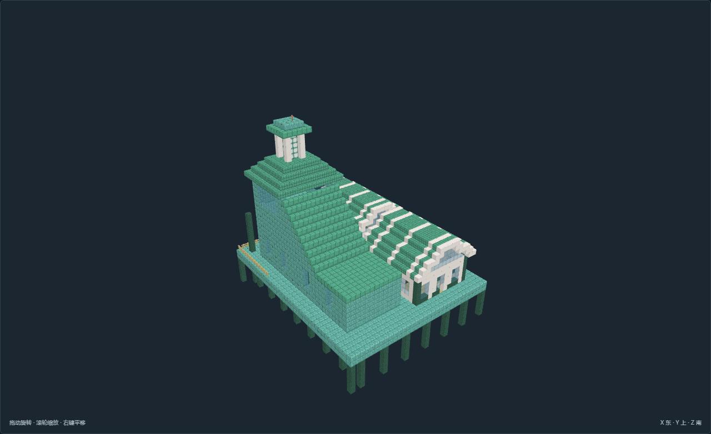
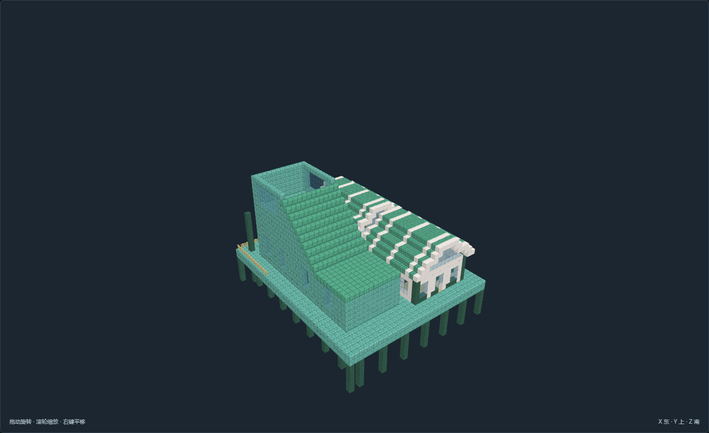

# TC-12-v01 青阶旧标 · 旧潮标塔

[返回核心清单](../../建筑清单.md)

尺寸X×Y×Z：37 × 38 × 45；角色：`planning_role.structure`。主审完成离线全图验收，最终证据24张。

双间生活小屋与狭长高塔分离，侧向实体阶梯抵达封闭观测层，旧色标留在海侧；值守、寝室、维护和航路观测分层组织。

## 造型与陈设

阶梯封闭长塔升至透光灯笼冠，低处双拱生活屋与高标灯构成层次；塔冠为静态航标，不声明真实照明航行机制。

## 空间与用途

前部值守生活屋：淡水储备、连续备餐与六人餐席

独立值守寝室：独门床柜、日志和衣物

旧塔楼梯与维护：下层零件维修、侧向连续实心梯级与两侧护栏

塔上有窗观测间：完整登陆平台、海图长案和朝海玻璃窗

## 适用条件

选址：避风浅海、潮间带与稳定岸台；模板柱脚Y=0须接连续承载海床，不能悬空生成

潮位：本模型参考静水面Y=5，低潮Y=3，预期高潮Y=6；不是潮汐模拟，实际浪高及风暴增水另核对

干湿区：常用干地板Y=7、步行脚底Y=8；指定水槽与历史淹没区例外，入口以标记为准

接驳：北侧为陆路或干式栈桥入口；水侧作业接口不替代普通步行路线，船舶吃水与上下船机制另接

供给：淡水由岸上补给或收集后处理；水盆与食品柜表达储备，不假定海水可饮用；驻留与生产均需岸上补给

边界：原版静态珊瑚色建材与海洋设备陈设；不证明潮门、潜水、呼吸、流体或机器已运行

风格表达：海洋幻想：贝壳弧顶、浅色壳肋、青绿耐候表面与独立水陆空间；不将风格名直接当作选址条件。

## 验证与预览

[NBT](structure.nbt) · [作者标记](author.json) · [数据与导航](validation.json) · [实看记录](review.json) · [截图双哈希](previews/capture.json)

数据和导航零警告。未运行MC；地形预览为适用条件示意，不证明生长、流体、机器或运行时生成。

