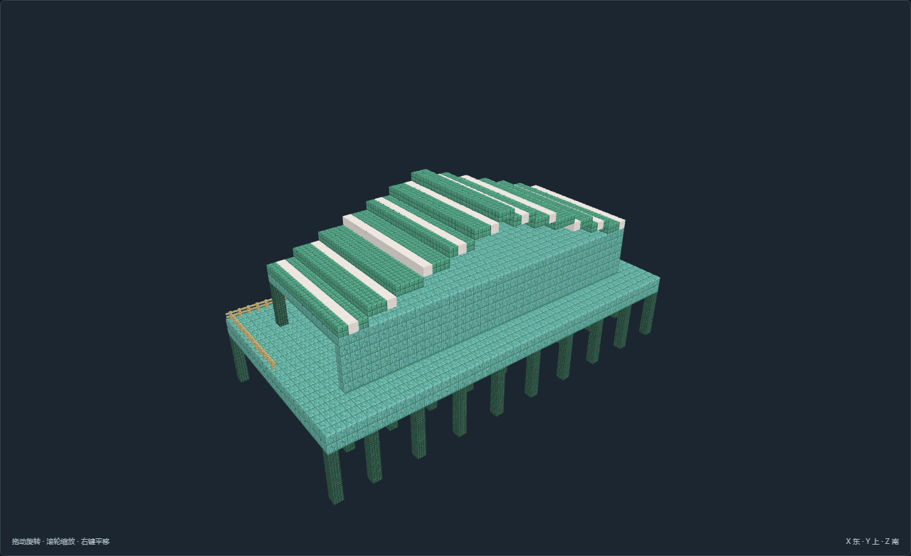
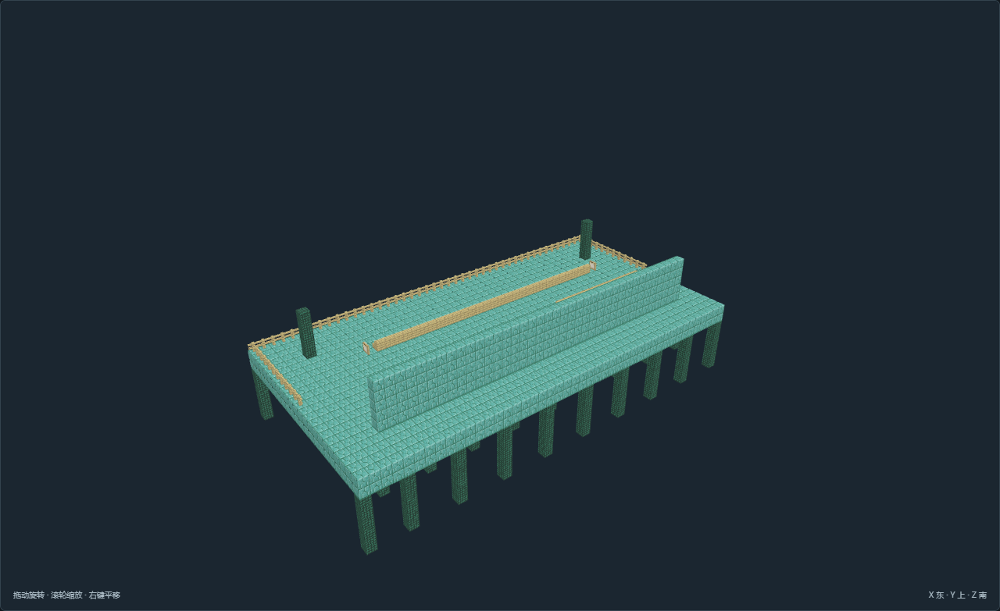

# TC-F03-v03 贴墙工具长棚

[返回填充清单](../../建筑清单.md)

尺寸X×Y×Z：49 × 36 × 27；角色：`planning_role.fill`。作者实看发布，待主审复核；最终证据12张。

贴墙工具长棚；开放遮棚提供明确休憩、维修或货运用途，连续柱梁承载贝肋屋盖，临水边护独立连续。

## 空间与用途

背墙维护棚：背墙工具柜和维修，前方坐席及侧通路

## 适用条件

选址：避风潮上岸台或人工桩台；水侧支柱底Y=0必须接稳定海床，不自动适应任意水深

潮位：低潮Y=3、参考水面Y=5、预期高潮Y=6；主层干地板Y=7、脚底Y=8，潮汐仅为条件记录

支撑接驳：北侧接Y=8普通步行道路；所有楼梯为实体台阶。高层与分台另有房间高程，不依赖跳跃或游泳

供水生活：厨房淡水和食物依岸上补给；海水不能视为饮用或灌溉水。居室采用干燥外壳，气候通风与实际水密另验

风格：棱面近似贝壳的弧顶、放射或分瓣舱室、青绿石质桩台；风格不是国名

限制：原版静态模型；不代表潮汐、潜水呼吸、流体、生产或运行时生成已接入

## 验证与预览

[NBT](structure.nbt) · [作者标记](author.json) · [数据与导航](validation.json) · [实看记录](review.json) · [截图双哈希](previews/capture.json)

数据和导航零警告。未运行MC；地形预览为适用条件示意，不证明生长、流体、机器或运行时生成。

