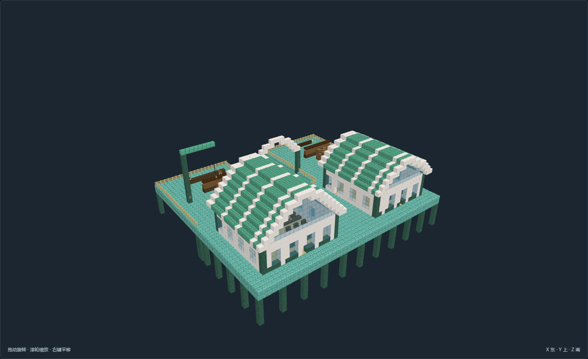
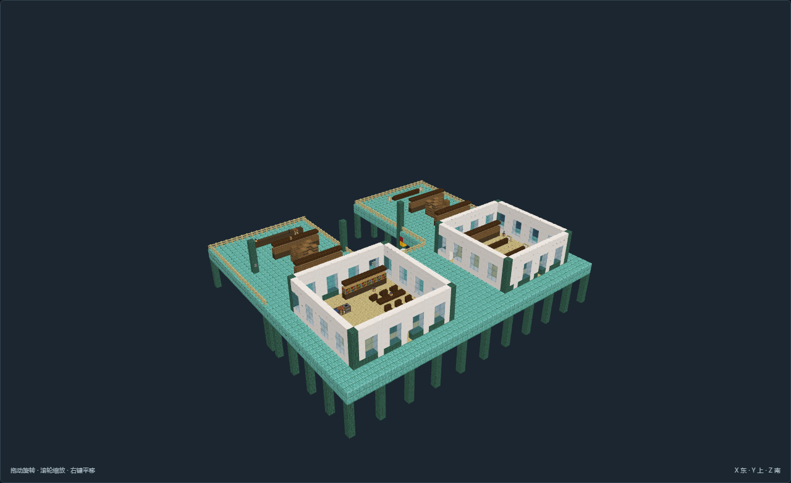
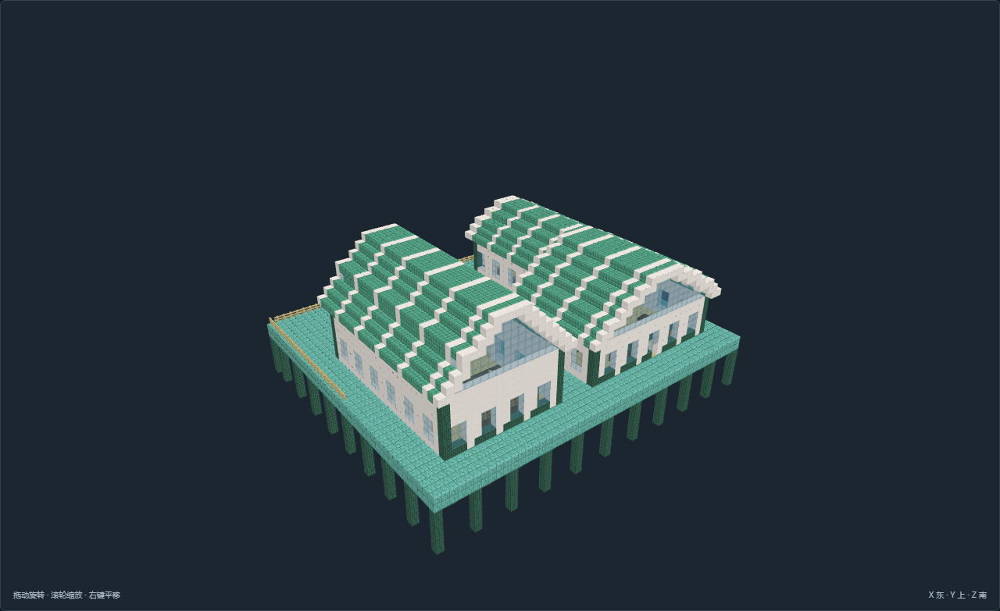
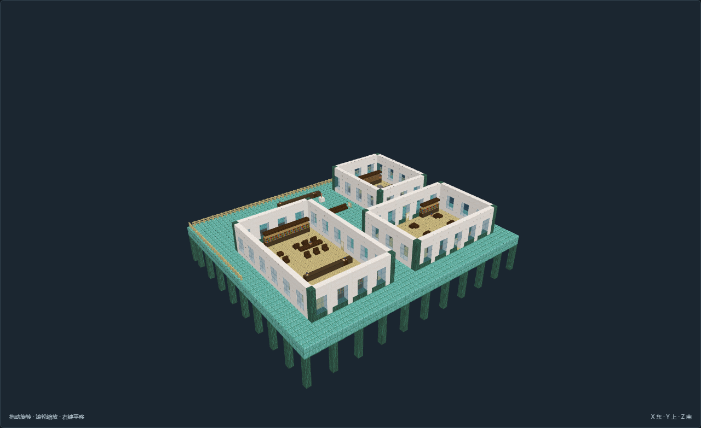

# 海洋幻想核心验收画廊

[返回入口](README.md) · [核心清单](核心结构.md)

6项137张新版最终图全部由主审实际查看并归档。仅离线验收；地形水面为条件示意，不代表潮汐或水密模拟。

## TC-01-v01 双齿泊湾 · 潮门港

[模型说明](models/TC-01-v01/README.md) · [全部26张证据](models/TC-01-v01/review.json)

## TC-08-v01 玻璃双舱 · 水下考察站

[模型说明](models/TC-08-v01/README.md) · [全部27张证据](models/TC-08-v01/review.json)

## TC-09-v01 折翼观海院 · 海流学馆

[模型说明](models/TC-09-v01/README.md) · [全部25张证据](models/TC-09-v01/review.json)

## TC-10-v01 珊环公庭 · 潮汐议事庭

[模型说明](models/TC-10-v01/README.md) · [全部19张证据](models/TC-10-v01/review.json)

## TC-11-v01 回水残藏 · 淹没档案馆

[模型说明](models/TC-11-v01/README.md) · [全部16张证据](models/TC-11-v01/review.json)

## TC-12-v01 青阶旧标 · 旧潮标塔

[模型说明](models/TC-12-v01/README.md) · [全部24张证据](models/TC-12-v01/review.json)

