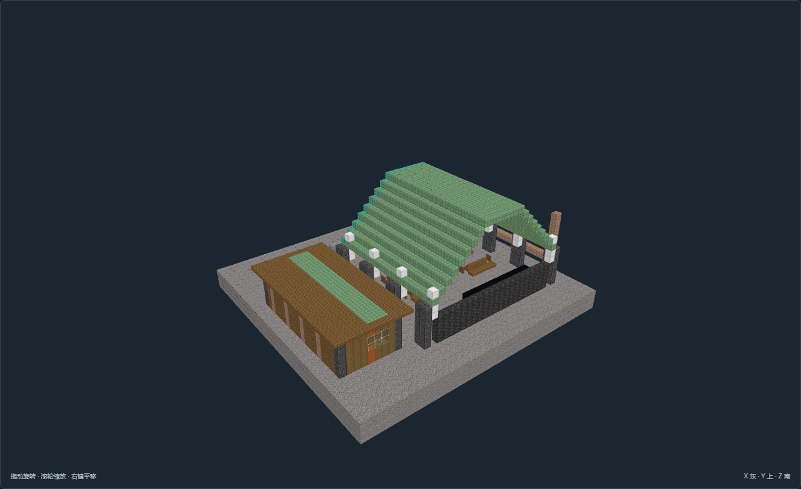
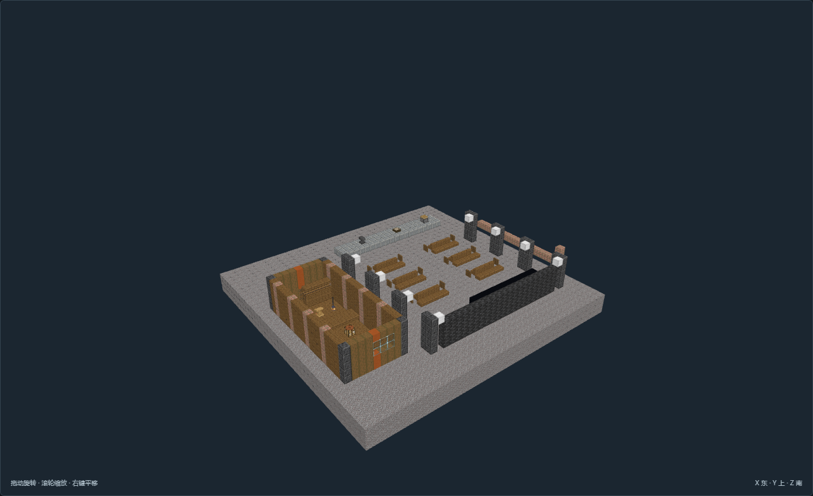

# RS-10 旧锅炉半壳学堂

角色 `planning_role.key`，尺寸 43×24×41。18张当前最终视图作者实看通过；确定性重建、数据与导航零警告，待主审。

深色旧机梁、齿轴与氧化铜壳为旧骨架；浅木、橙色板补丁与布棚为后加住用空间。

功能分区：

- 藏品修复侧屋：有独立旧场坪支承的后加板房，门窗和完整使用通路
- 旧锅炉壳内课堂：六组抄录桌椅、讲台与黑板，不将残骸仅作外部摆设

使用点：旧世技艺讲台、抄录与课堂桌、旧世讲义与资料、修复耗材与待修藏品、藏品修复操作、藏品编目与借阅、拆解旧机件教学展台、搬运路入口。

落地条件：

- 选址：废旧锅炉底座上保留巨大弧壳与停用管道，教学区和修复侧屋分别有独立地坪支撑。
- 接地：完整旧机座埋入稳固碎石台地，地坪Y=2、入口脚底Y=3；不将薄壳残板当作新房基础。
- 外接：南侧接既有搬运路；模板外须保留回转、排水与坠落隔离带。避开活动滑坡、洪道及悬空残骸。
- 供给：生活水依外部运水，燃料和食物由聚落补给；不假设旧机械仍能工作。
- 边界：独立承载静态原版结构；残骸稳定、探险门禁与设备功能未接入运行时。

[NBT](structure.nbt) · [作者标记](author.json) · [双哈希图审](review.json) · [完整捕获清单](previews/capture.json)

未运行MC；旧设备与封存界面为静态空间表达，未接机器、门禁、探索或生成机制。
