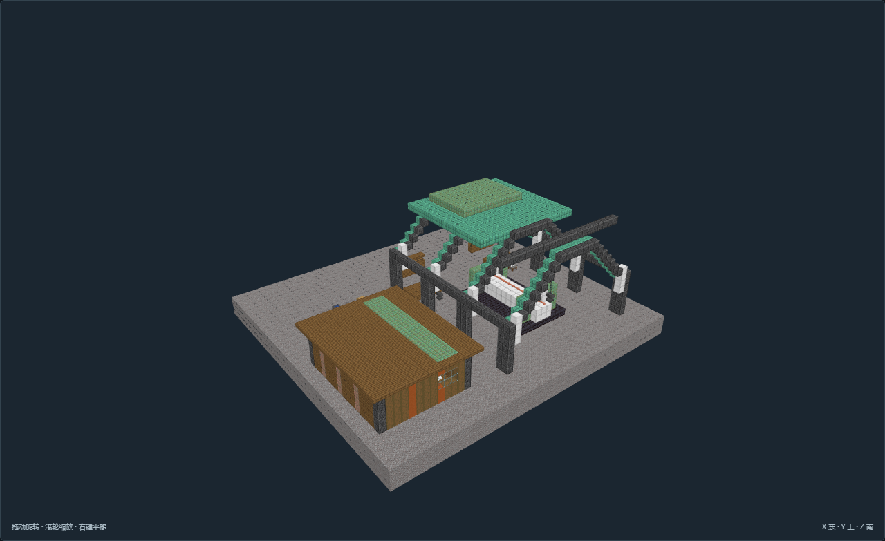
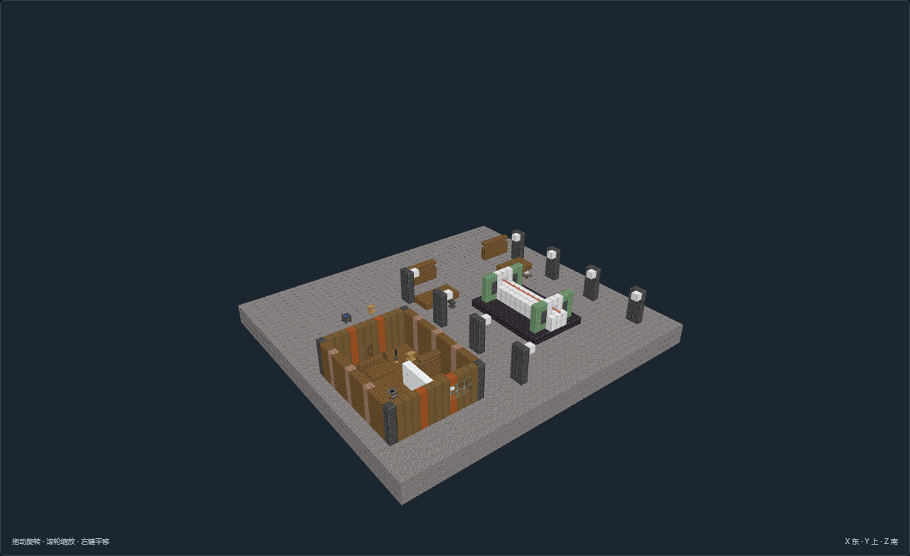
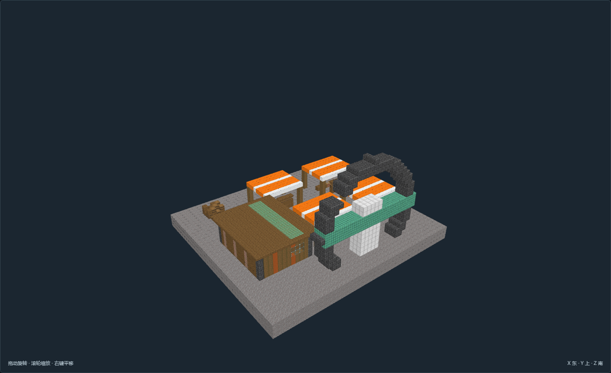
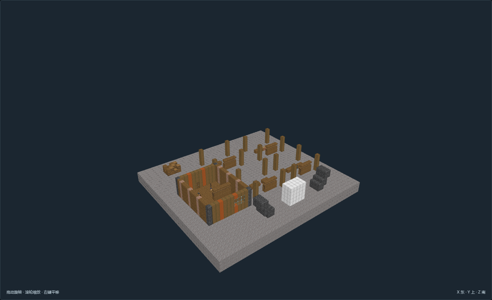
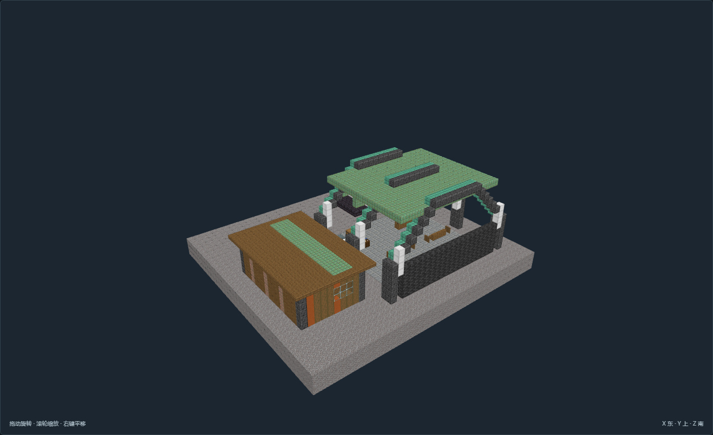
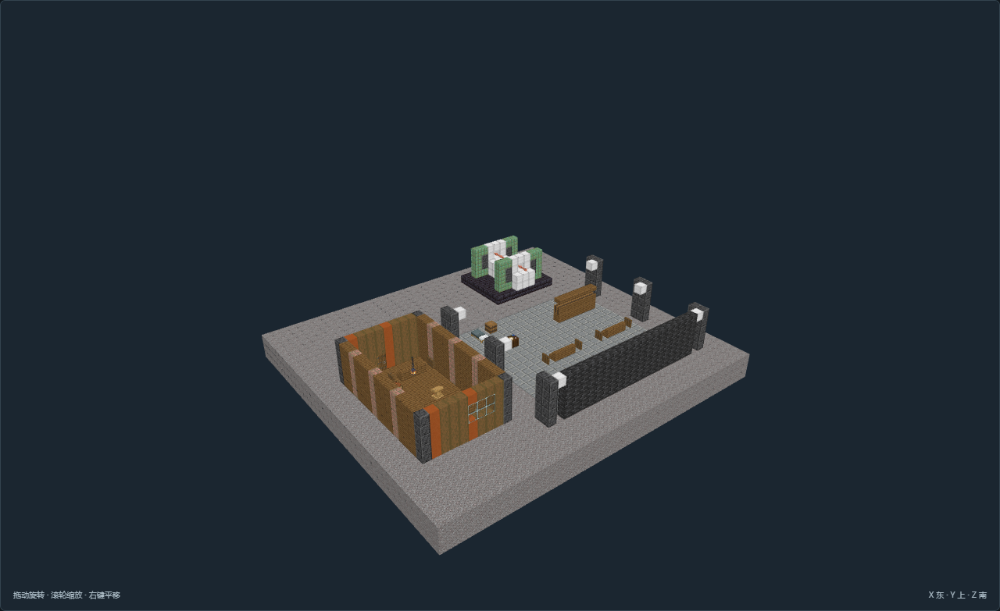
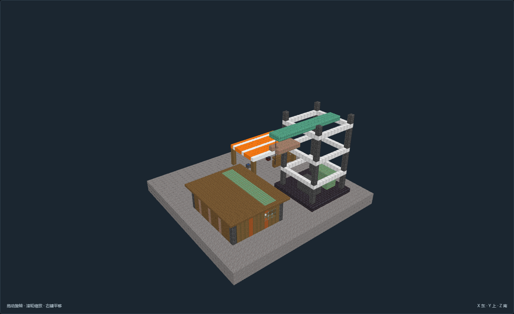
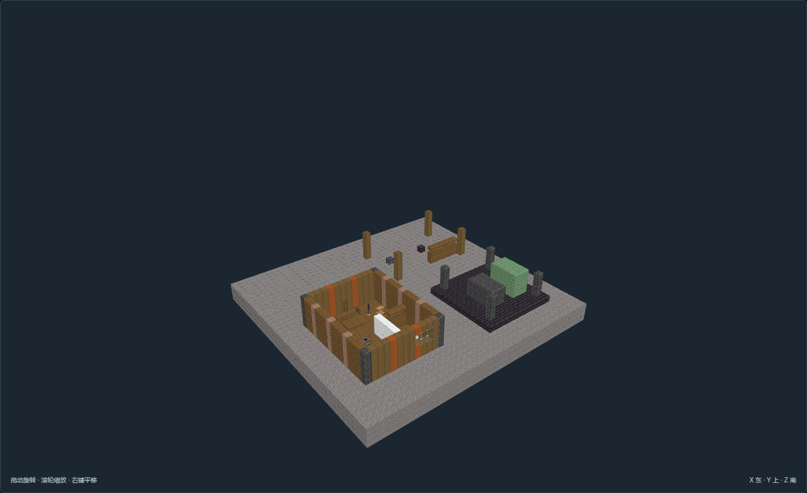
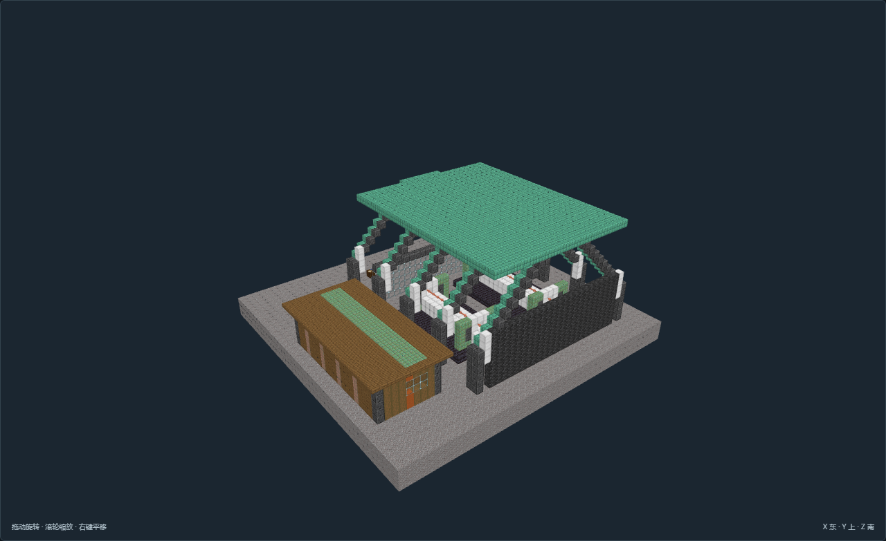
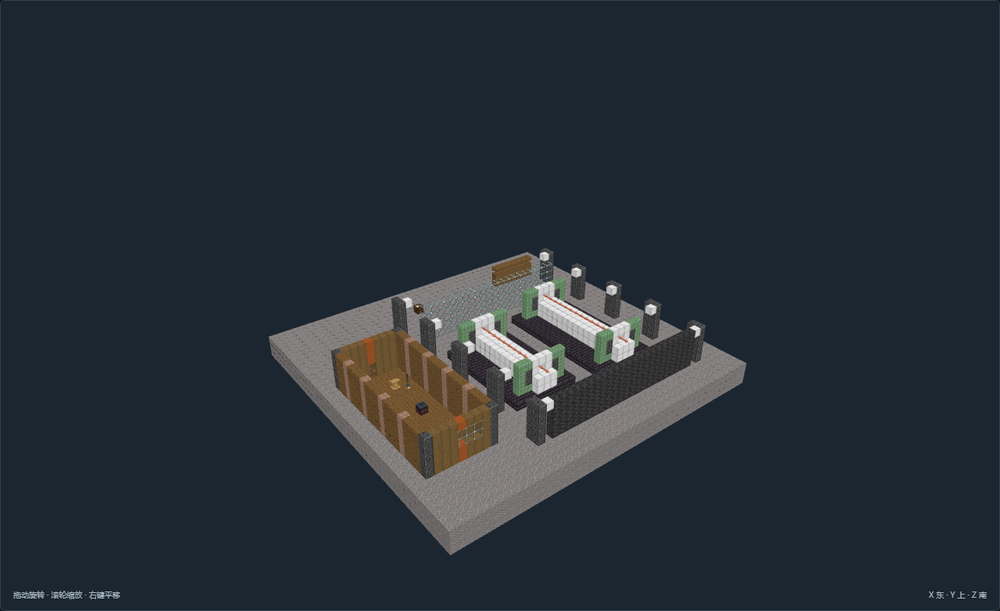

# 废土拾荒预览画廊

## RS-02 巨械肋架拆解大厅

[完整模型说明](models/RS-02/README.md)

## RS-03 断轮广场零件市场

[完整模型说明](models/RS-03/README.md)

## RS-04 断裂控制舱与侧接档案间

[完整模型说明](models/RS-04/README.md)

## RS-10 旧锅炉半壳学堂

[完整模型说明](models/RS-10/README.md)

## RS-11 断继电塔下旅途营地

[完整模型说明](models/RS-11/README.md)

## RS-12 封存动力舱设备库

[完整模型说明](models/RS-12/README.md)

