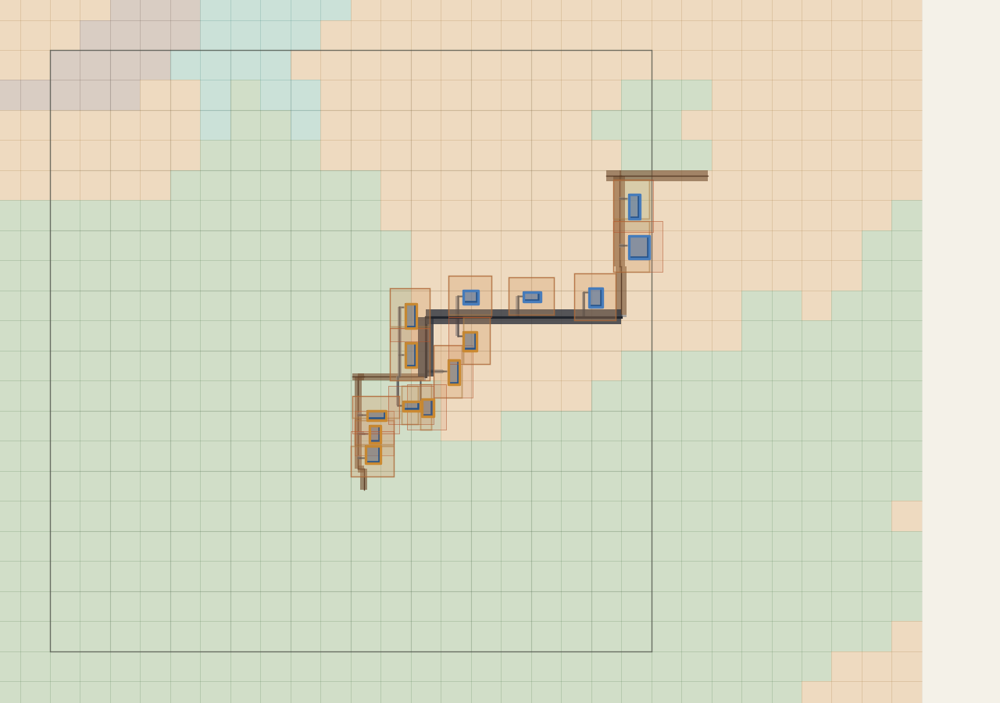
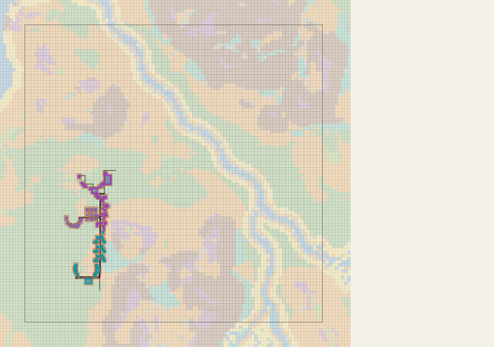

# 新世界前两城验收

*需求入口*：用户“还可以，这个城市我给80分，记录一下呗，然后帮我看看刚刚好的第二座吧。你记录的时候麻烦把预览图、纠错的报错原因和纠错方法和花费时间写进去呗”。

*修改内容*：保存两座城市通过时的预览、最终蓝图、质量报告、纠错会话时间线与队列快照，记录玩家评分和复验位置；未修改实现或存档。

*验证结果*：前哨站玩家评分 **80/100**，原话“还可以”。首都玩家评分 **80/100**，原话“第二座城市……我也是80分”。两城均进入 waiting_for_generation；这不等于所有区块已实际生成。以下耗时为北京时间墙钟时间，不是模型纯推理时间，也不代表扣费时长。

*剩余问题*：首都住宅区仍有巷道缺失/不连通的阵列观感警告；全城入口连接检查通过。首都玩家已验收并评 80 分；仍保留程序巷道警告，作为后续优化参考。

## 第一座：学术绿洲前哨站 — 玩家 80 分

- 存档：`新的世界`；runId：`provider_7dcd2ed26663924e_r8192`。
- cityId：`city_sahra_valdoran_library_qasr_ilm`；种子中心 X=784，Z=4048。观察命令 `/tp @s 784 150 4048`（Y=150 为观察高度）。
- 最终 14 个建筑锚点，学术核心、工坊防御两个功能区，均为 COMPACT；1 条功能区主路连接；硬阻塞与质量警告均为空。程序安全分不替代玩家美观评分。
- D4 上下文 20:14:11.840 → FINAL 20:17:58.311：**3 分 46.471 秒（约 3 分 47 秒）**；第一笔提交 20:15:16 → FINAL 约 2 分 42 秒。20:17:59.288 进入等待生成。
- 另计运行前程序阻塞：19:36:39 T4 完成 → 20:14:11 D4 准备约 37 分 33 秒，包含人工排查、修复、打包、换包及等待，不能算作 AI 设计耗时。根因是 T4 允许 outpost，D3 不识别；修复为 outpost → HAMLET，保留角色与选址，见 [修复记录](../../../realm_planning/active/20260908_前哨站规模跨阶段不兼容/任务记录.md)。

| 时间 | 报错 / 反馈 | 实际纠正 |
|---|---|---|
| 20:15:16 | CITY_BLUEPRINT_FIELD_MISSING：缺 surfaceDetailProfile | 20:15:45 补齐字段 |
| 20:15:45 | CITY_BLUEPRINT_FIELD_UNKNOWN：景观不支持 properties | 20:16:12 删除该字段 |
| 20:16:12 | CITY_BLUEPRINT_OUTDOOR_LANDSCAPE_SOURCE_REQUIRED：独立景观缺合法落位约束 | 20:16:39 补 placementDomain 并令 required=false，20:16:40 草稿通过 |
| 20:17:00 | CITY_BLUEPRINT_PATCH_REQUIRES_EXACT_SHARES：补丁用了 RELATIVE_WEIGHTS | 20:17:08 改 EXACT_SHARES，补丁通过 |
| 有效草稿预览后 | 模型认为工坊防御区 organic_compact 太散、道路与间隙欠佳（此行是模型看图判断） | 将该区算法改为 compact；最终质量报告无警告，20:17:58 FINAL 通过 |

格式预算共记录 4 次失败，未耗尽 10 次机会。中间有效草稿及最终通过不算错误。详见 [纠错时间线](前哨站/纠错时间线.json)。

## 第二座：Sahra Valdoran 首都 — 玩家 80 分

- cityId：`city_realm_sahra_valdoran_capital`；种子中心 X=-1424，Z=5296；种子中心观察命令 `/tp @s -1424 150 5296`。建筑实际偏向西侧，市政厅锚点 X=-1780、Z=5304，建议验收用 `/tp @s -1780 150 5304`。
- 最终 91 个建筑锚点；行政核心、市场、住宅三个功能区，最终均为 COMPACT，面积份额 32% / 32% / 36%；3 条功能区连接。主图可见建筑集中在规划框西南侧，整体偏南北狭长；该描述是预览观察，不是游戏实景结论。
- D4 上下文 20:18:48.863 → FINAL 20:31:59.557：**13 分 10.694 秒（约 13 分 11 秒）**；第一笔提交 20:19:50 → FINAL 约 12 分 10 秒。20:32:02.448 进入等待生成。
- 格式预算记录 7 次失败；另有 20:28:21 明确几何拒绝，成功后的失败预算已重置，不能用最终 failureCount=0 声称从未几何失败。

[首都设计局部放大](首都/设计局部放大.png)

| 时间 | 报错 / 反馈 | 实际纠正 |
|---|---|---|
| 20:19:50 | 缺 surfaceDetailProfile | 下一提交补齐 |
| 20:20:23 | 缺 groups[0].compositionProfileRef | 下一提交补齐 |
| 20:21:29 | CITY_BLUEPRINT_JSON_INVALID：组需提供 fillPoolRef 或 fillPools 之一 | 20:21:59 补填充池 |
| 20:21:59 | 景观不支持 type 字段 | 20:22:27 删除 type |
| 20:22:27 | 中心对称阵列中心建筑数不合法；两个 CORE；ADJACENCY 使用 NEAR；独立景观落位约束不满足 | 20:23:02 改核心为 compact、市场降为 STANDARD、ADJACENCY 的 distancePreference 改 NONE、景观改 ATTACHED 并绑定行政区 |
| 20:23:29–20:27:28 | 有效草稿存在巷道、空隙、院落门路或临街观感警告 | 调整留白/密度；市场 organic_compact → compact；行政区依次试 organic_compact、courtyard、linear，再回 compact 并调范围份额。不是每次调整都因编译拒绝 |
| 20:28:21 | CITY_BLUEPRINT_REQUIRED_STRUCTURE_NO_LEGAL_PLACEMENT：换到坡地后必要建筑无合法位置 | 20:28:39 回到原平地 p.216，偏好 NORTH，与南侧市场分离；草稿通过 |
| 20:29:30–20:30:51 | 持续处理观感反馈 | 行政区改 DENSE、调整份额；完整蓝图增加西侧住宅区及连接 |
| 20:31:39 | CITY_BLUEPRINT_INPUT_EXACTLY_ONE_REQUIRED：FINAL 只带 hash，未带蓝图或补丁 | 先尝试空补丁 |
| 20:31:47 | CITY_BLUEPRINT_PATCH_SIZE_INVALID：空补丁不合法 | 20:31:55 提交非空 replace 补丁，保持 DENSE；20:31:59 FINAL 成功 |

最终硬阻塞为空，建筑图与入口连通检查通过；住宅区仍有 `COMPACT_ALLEY_MISSING` / `COMPACT_ALLEY_DISCONNECTED`，`qualityFullySatisfied=false`。不能将程序 `score=100` 当成美观满分或无警告。详见 [质量报告](首都/quality_report.json)、[纠错时间线](首都/纠错时间线.json)。
