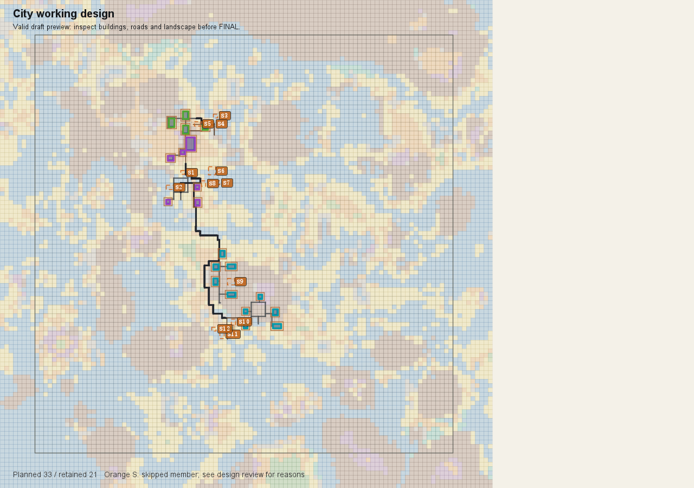
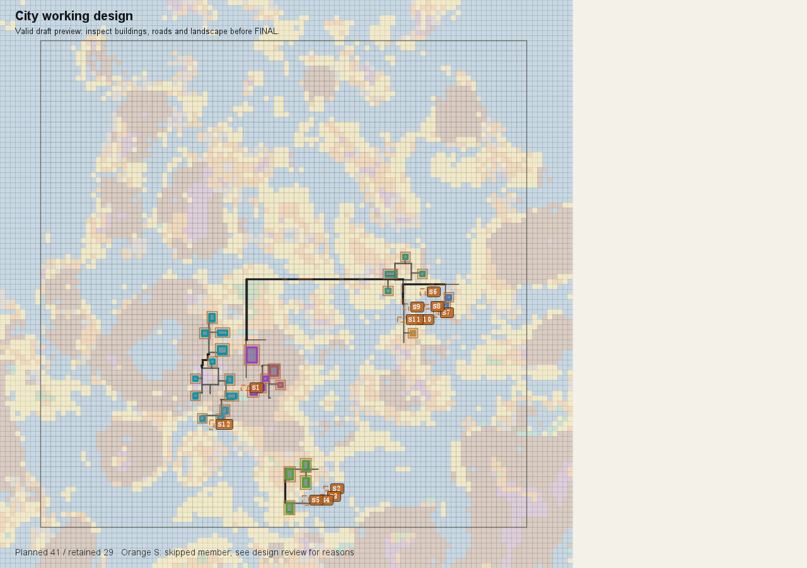

# 意图驱动规模与完整阵列设计

*需求入口*：`E:/Mod_Dev/designer_territoryMod/docs/systems/city/10_product/案子/具体流程的案子/00_跨阶段主线/City意图驱动规模与嵌套设计-v0.1/README.md`；用户要求完整开发，静态检查后仅对照本案审查，再真实游玩并交付 D4 预览。

*修改内容*：开发中。范围为分阶段功能区意图、选材与容量估算、按规模设计与预览反馈、嵌套及完整阵列相邻落位、取消面积补量和连接补建筑；保留第七节已有道路与台面能力。

*验证结果*：尚未执行。真实游玩待开发与需求逐条核对完成后开始，停在可审查预览，不激活世界生成。

*剩余问题*：各档硬数量与主体比例没有用户确认，保留建议，不新增门槛；成员逐栋省略已由用户确认。本次仅实现规模与嵌套案，林地任务不混入。

## 开发后、测试前逐项核对（2026-09-13）

仅对照本案 AI 需求总结，未读取其他产品案正文。

| 本案章节 | 实现落点与核对结论 |
| --- | --- |
| 1 分阶段意图 | 同一 submit 工具持久化 designIntent、批量 materialSelections；prepare 回传会话。DRAFT 接受完整子组团，FINAL 保留规模设计门槛。 |
| 2 估算 | 选定作者素材返回尺寸、按 Patch 宽深及间距的容量估计，明确不是面积指标或落地保证。 |
| 3 嵌套及贴靠 | 先自底向上组合矩形，再整体平移；ADJACENCY 贴靠，CONNECTION 不移动/补建筑；保留递归与独立选址。 |
| 4 规模 | 五档建议及既有 CITY/LARGE_CITY 嵌套门槛沿用；新增计划数、保留数、嵌套承载量报告。取消两个自动补建筑调用链。主体硬比例仍待确定，不擅定。 |
| 5 预览修订 | 草稿反馈加入计划/保留审查；预览橙色虚框 S 对应逐栋跳过记录；保留原有哈希补丁与有效底图。 |
| 6 地形 | 固定槽位和模板选择；禁止因前项跳过搜索额外槽位、换模板补洞。大起伏逐栋跳过；浅小水坑要求周边八格采样陆地且非河湖海地貌，保留采样局限。空组改为警告。格式和作者能力故障仍拒绝。 |
| 7 既有底座 | 沿用道路接口和台面；主路改到建筑筛选后连接，不抢建筑；缺失端点明确记为跳过，不伪装连通。 |

静态编译：compileTestJava 成功（含 MCP TypeScript 编译和 bundle）；尚未执行测试或真实游玩。发现的问题均先修正再进入测试：旧主路先行占地、缺失端点空指针、固定布局仍重选模板、terrain 工程模式吞掉极大山体起伏。

## 真实游玩前复核
分阶段接口、Provider 独立 schema、Hermes 提示和 PlanningTurnControl 已同步；意图/选材不误结束回合，DRAFT 让宿主附加预览。固定成员测试覆盖地形变化后其余坐标、模板、朝向不变。相关回归通过；全量 939 项（9 skipped）仅原有景观性能 8 秒用例超限 761ms，单独复测通过，未改性能门槛。新旧断言按本案删除自动补量/整城地形失败预期，保留几何、安全和作者能力检查。当前进入 MCP 工具使用者阶段，不读源码。
测试存档：run/saves/RTF_intent_nested_20260913，复制既有 RTF_city_scale_20260910（排除 session.lock），复用最高有效地形。目标城市与大城市预览，停止在设计确认，不激活生成。

游玩环境轮 1 结束：启动参数指定新副本，但 DevAutoLoadClient 日志实际选择 RTF_beta_validation_01，realm_status debugRoot 亦证实，未提交城市。内置单人服没有 stop 命令（player/server 上下文均 DEBUG_COMMAND_NO_SUCCESS），改为关闭本次启动的客户端窗口保存退出。接下来只修正启动配置，使用 Base64 参数避免旧覆盖值抢占。证据在 playtest/07-52 至 07-54 的调用与 build/city_intent_gameplay/client.log。

游玩环境轮 2 结束：复用 W 后经 MCP 完成 T1/T2/T3/T4 与首都 D3。首都实际 scaleClass=city；第二座城市一个候选因出生点3072格排除圈被拒，改SHORE-03成功。D4 prepare 返回 PROVIDER_MANAGED_CITY_SOURCES_AMBIGUOUS（两套同源资料目录），未编译阵列。按现有启动配置显式指定正式作者目录后续测。实时采样明确返回 Minecraft prior / generator_context_unavailable，本轮不可称RTF原生地形验证。全部调用及图片在 playtest。

环境修正：正式旧目录默认 reviewed_required 且缺入口审核 sidecar，客户端3启动失败。pcl_validation_02 本身明确 entrancePolicy=legacy_catalog，结构用途为既有 approved；客户端4改用此既有完整验证目录，不修改或伪造审核数据。
客户端3启动失败后挂起仍持有存档锁，CloseMainWindow 后仍 Responding=false；确认本任务16:11启动进程34092后终止，客户端4因锁未进档已正常关闭。再次用相同pcl目录启动。

真实CITY轮结束：D4意图533/550ms量级，选材批量成功。初次格式错误ADJACENCY+WEST按提示改NONE，一次格式失败。3张有效DRAFT依次33计划保留6/15/21，耗时2620/8851/15204ms，8叶阵列均为AI嵌套，自动建筑0。最后保留21但卫所为空、部分道路不通，不FINAL不激活。证据08-19至08-23。首都实际CITY；T4封存不可修改，另建会话重选首都会CITY_SEED_ID_DUPLICATE，原封存会话追加会SESSION_NOT_OPEN。无工具可改档，结束轮次后为LARGE单独复制最高有效T3上游副本，保留原测试全部证据。

真实LARGE副本轮暂止：首都以同方案复验得到21/33；FINAL接受，D4正式编译812ms/D5 120ms/D6成功，city_plan_land_use在135ms时报CITY_OUTDOOR_STRUCTURE_GROUP_UNKNOWN:guard。guard为D4合法筛空组，下游与本案口径不一致，归程序修复，不让模型删除需求绕过。证据08-37-23 poststatus。停止工具使用者阶段后定位下游空组。

后续修复与入场前复核：选材估算改为D3实际成员格面积（旧areaBlocks可能是包围盒），stage回归测试通过；MCP残留外扩补量描述同步。户外编译将Blueprint已声明空组初始化为空集合并记录CITY_OUTDOOR_EMPTY_ARRAY_SKIPPED，foundation跳过空组，未知组仍拒绝。新增移除core成员但其余农区台面正常的回归；CityOutdoorBlueprintCompilerTest全类通过。对照本案第2/6/7节，不新增其他案需求。

真实游玩结束（2026-09-13 16:49）：修复空组后，首都后处理进入waiting_for_generation，第二座large_city从正式队列取得设计权。LARGE意图+选材均成功且成员格面积9472/23040与TopPatch一致；12叶阵列4组合，41计划，两次DRAFT保留26/29，耗时3552/3286ms。FINAL2945ms通过既有大城市嵌套门槛；正式compile1739ms成功，保留29、自动补建筑0。D4意图首提交16:44:59至FINAL16:48:16约3分17秒，5次submit（意图、材料、2预览、确认），不含选址、D3、环境排查和人工记录时间，不代表GLM性能保证。大城市未推进D5/生成；首都仅WAITING，无城市区块验收。当前方案仍含farm_homes空组、缺失通路和组团分散，功能安全通过≠美观验收，不能给80分。
本轮为实时Minecraft prior生成器，虽加载RTF模组但不是RTF原生地形验证。UI图是实际MCP产物，无模拟城市/伪造截图。
## 最终核对与交付

仅对照本案七节核对，已确定需求均有实现；未确定的主体硬比例不新增，景观独立生长另案不纳入。实现状态已同步本案标题和契约。真实测试暴露的成员格面积估算、已声明空阵列导致户外阶段阻塞均已修复并回归。

最终完整 `gradlew build` 成功（2分46秒）；JUnit 942项，0失败、0错误、9跳过。此前性能用例单次超限在最终完整测试中通过，未放宽门槛。MCP 11项测试通过。双仓库 diff --check 通过。构建产物：`E:/Mod_Dev/StructureBinder/build/libs/geomantia-0.1.0.jar`。本次未提交 Git。

| 规模 | 叶阵列 / 嵌套组合 | 计划 / 保留建筑 | 自动补建筑 |
| --- | --- | --- | --- |
| CITY | 8 / 3 | 33 / 21 | 0 |
| LARGE_CITY | 12 / 4 | 41 / 29 | 0 |

CITY 实际 D4 预览：

LARGE_CITY 实际 D4 预览：

橙色 S 框表示逐栋跳过的位置。保留建筑、空组和道路缺口均如实反馈给设计者；当前图仍稀疏、组团间距大，不能宣称美观验收通过。本轮由本助手直连真实 MCP 设计，并非 GLM 自动流程；未做城市区块生成及 RTF 原生地形实景验收。

## 19:34 按用户要求重排预览（本轮结束）
复用原大城市冻结D4上下文，未修改源码或目录配置。正式目录没有GRID，使用LINEAR商业父阵列与COURTYARD行政/住宅父阵列，农业保留COMPACT。第一次住宅与商业同贴行政，41保留23；第二次改住宅贴商业，保留26，远岸长连接消失；第三次核心同Patch南移，保留仍26。三次均DRAFT有效，约4.7/3.1/3.5秒。缺口包含占地碰撞，不能全称为地形筛选。主体更集中，但农业仍断开、未形成完整主街广场，不判美观通过。停在DRAFT，无FINAL或生成。本轮请求及返回11-31-52、11-32-44、11-33-20；详情裁剪仅放大实际预览，没有补绘。

## 建筑占地按原始NBT（用户追加）
需求：删除影响建筑面积的附加膨胀。纠正此前解释：Template构造器已把clearance归零，配置4未生效；仍生效的是foundation margin、claimedArea的间距及乘数。开始统一建筑原始宽深/地块/容量估算，不把阵列通路与实际组合包围盒删成建筑重叠。验证待完成。

建筑原始占地本轮完成：去掉Foundation边距对模板空间需求的膨胀；建筑地块与碰撞使用原始NBT边界；claimedArea不再加密度gap或倍率；容量按原始矩形宽深且gap=0估算；组团包围盒按已选朝向的宽深，不为长条建筑包大正方形。道路与院落的排列空间保留，单一阵列的统一pitch仍属于布局算法，本轮未改为逐栋可变步距。旧clearance输入本来就在Template构造时归零，纠正先前误判。缓存版本升级避免复用旧占地候选。相关回归通过，最终完整build成功（2分38秒），942项0失败0错误9跳过；未重新实景生成/预览，未提交Git。构建产物build/libs/geomantia-0.1.0.jar已更新。需求原话和契约已同步。

## 提交归档
实现提交 a404bd1；策划与契约提交 3b211dd。本目录随实现提交归档，包含实际预览与调用证据。未推送远端。
